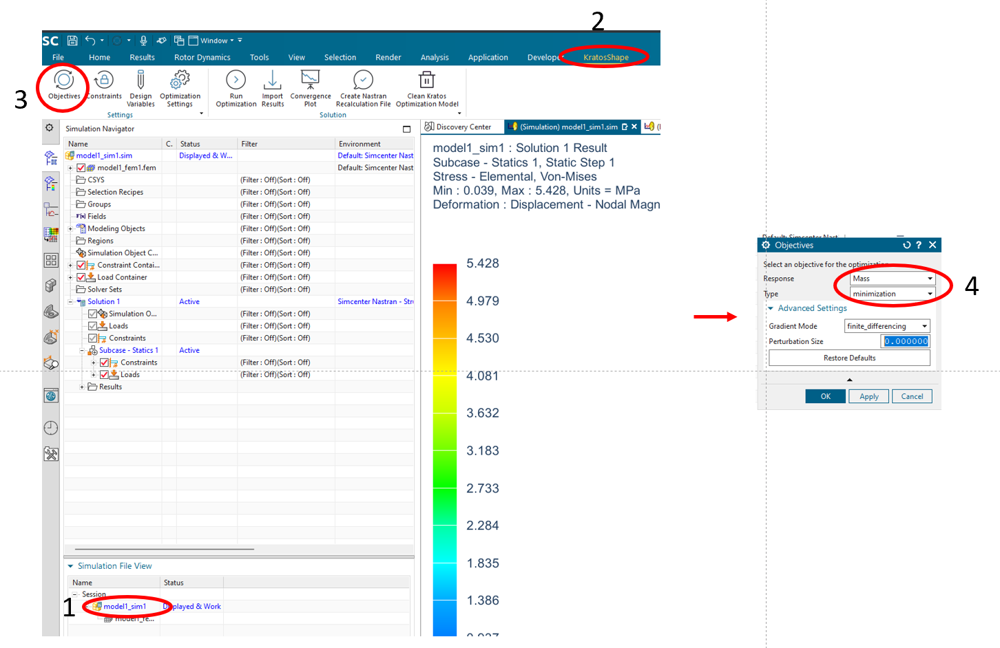
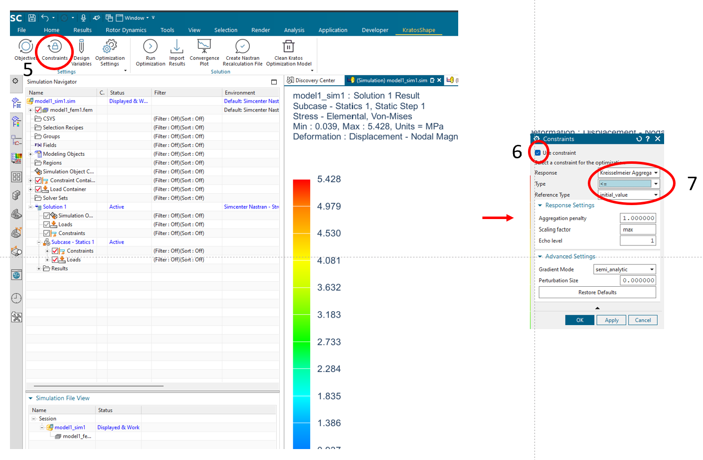
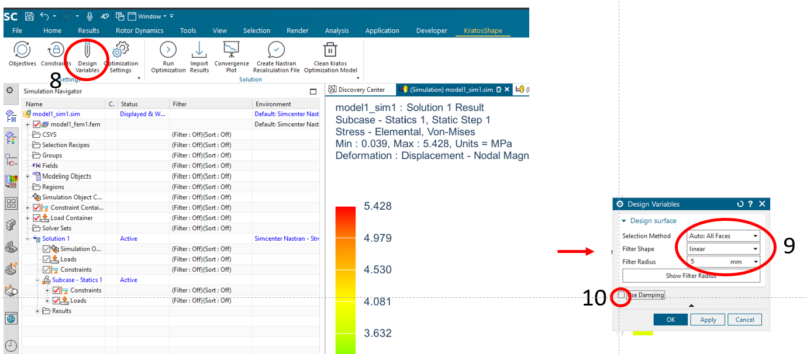
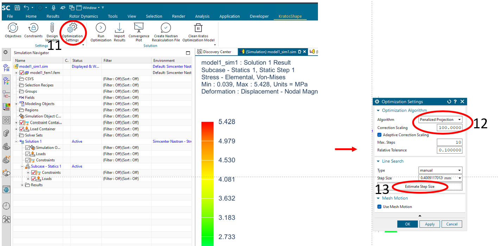
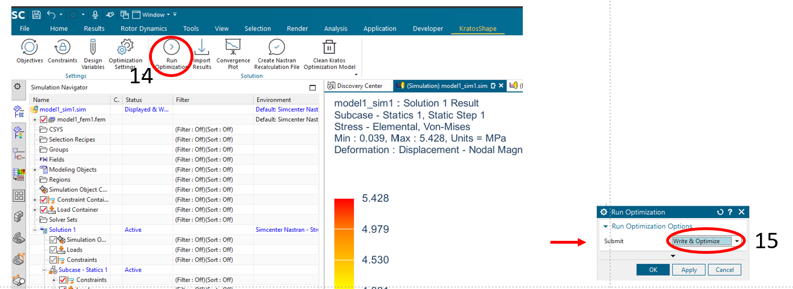
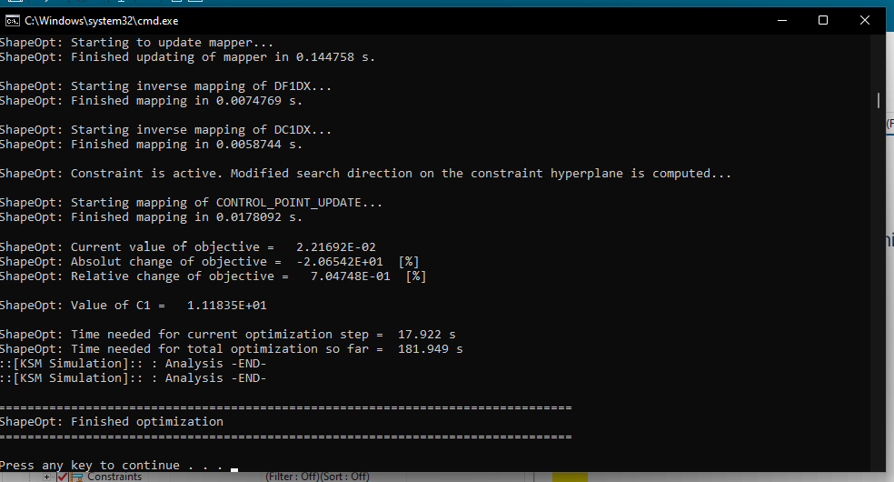
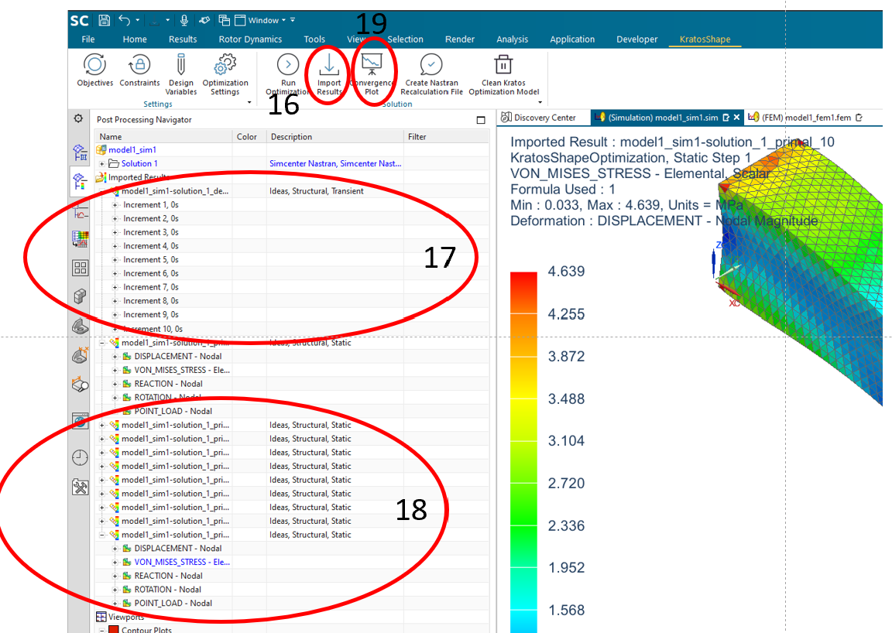
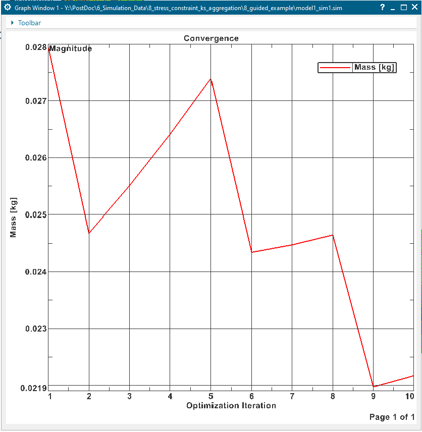
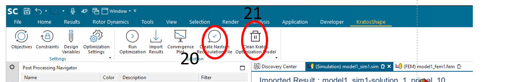

## Introduction

This example guides the user through a creation of the optimization problem in **Siemens NX** plugin using the constructed [primal problem](Primal_problem_construction.html).

## Optimization problem description

The optimization problem is constructed with one objective and a constraint as given below.

### Objective

The objective is to minimize [mass](../../List_of_response_functions/Mass.html) of the whole beam body.

### Constraints

The constraints is to have less than or equal max Von Mises stress in the whole body using [Kreisselmeier aggregation](../../List_of_response_functions/Kreisselmeier_aggregation.html) methodology.

### Design surface

Design surface is chosen to be all the surfaces of the beam.

## Optimization problem configuration steps

### Configuring objective

Figure 1 illustrates steps required to set the [mass](../Responses/mass.html) as the objective to be minimized. Refer [objective settings](../Objectives_and_constraints.html) section.

    

Figure 1: Setting mass objective

### Configuring consraint
Figure 2 illustrates steps required to set the [mass](../Responses/kreisselmeier_aggregated_stress.html) as the constraint. First "Use constraints" needs to ticked. Thereafter, "Response" is selected as "Kreisselmeier aggregated stress". "Type" of the constraint is selected as "<=". "Reference Type" is selected as "initial_value". Refer [constraint settings](../Objectives_and_constraints.html) section.

    

Figure 2: Setting stress constraint

### Configuring design variables

Figure 3 illustrates steps required to set design variables. "Selection method" is selected as "AUTO: ALL_faces" to select all the faces of the beam as design surface (refer step 9). Then "Filter radius" is chosen to be "5mm". Damping is removed for this example as in step 10 by un-checking the "Use damping" option. Refer [design variable settings](../Design_variables.html) section.

    

Figure 3: Setting design variables

### Configuting optimization procedure

Figure 4 illustrates the steps to correctly configure optimization procedure. Since ths problem is a constrained optimization problem, it is required to have "Penalized Projection" as "Algorithm". "Correction Scaling" is set to "100" for this example. Then the "Step size" is set by clicking on "Estimate step size" button. Refer [optimization settings](../Optimization_settings.html) section.

    

Figure 4: Setting optimization procedure

### Solving optimization problem

Figure 5 illustrates steps required to solve the optimization problem. "Submit" is chosen with "Write & Optimize".

    

Figure 5: Solving optimization problem

Once the optimization is completed successfully, then asimilar output as in figure 6 should be visible in the console output. Refer [run optimization](../Run_optimization.html) section.

    

Figure 6: Completed optimization run

### Post processing results

The results can be imported by using the step 16 as illustrated in figure 7. Section 17 shows the imported optimization results as a transient solution. Each time step corresponds to design iteration. Description of variables can be found in [imported results](../Import_results.html) section. Section 18 illustrates the imported primal solution results of each design iteration. The variable descriptions can be found in the [imported results](../Import_results.html).

    

Figure 7: Post processing results

Step 19 can be used to plot the objective (i.e. mass) variation with the design iterations as depicted in figure 8.

    

Figure 8: Convergence of mass objective

### Additional functionalities

Additionally, step 20 can be used to create a "Nastran" simulation file for the optimized designs. Step 21 can be used to clean the Kratos Multiphysics input files.

    

Figure 9: Additional functionalities

