## Introduction

This example guides the user through a creation of an primal problem in **Siemens NX** plugin to be used in an optimization problem.

## Primal problem description

Figure 1 illustrates the fixed beam configuration.

    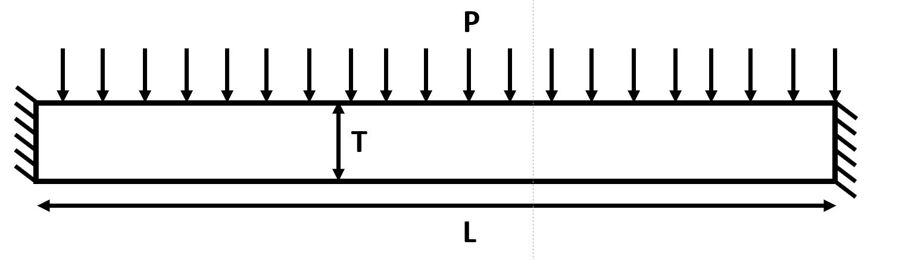

Figure 1: Fixed beam configuration

Following table illustrates the values used in this problem.

|Symbol| Value|
|------|------|
|L| $$100\,mm$$|
|T| $$10\,mm$$|
|P| $$ 100\,N$$|

## Primal problem configuration steps

### Creating a new project

First of all the geometry needs to be created. For that, you can open a new model by clicking "File" and then "New" as indicated in figure 2.

    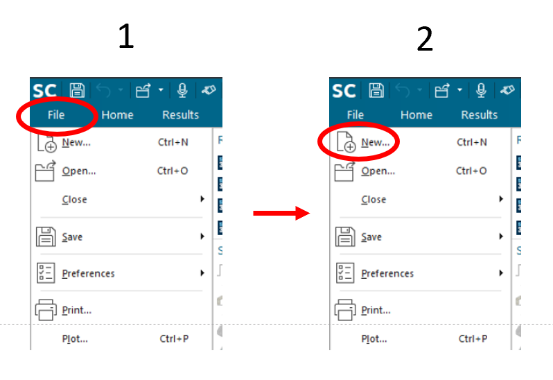

Figure 2: Choosing new

Then you will be given the "New" dialog box as shown in the figure 3. The 3rd step is to select "Model" in the "Templates" section. Then a proper "Name" and "Folder" should be given in 4th and 5th steps.

    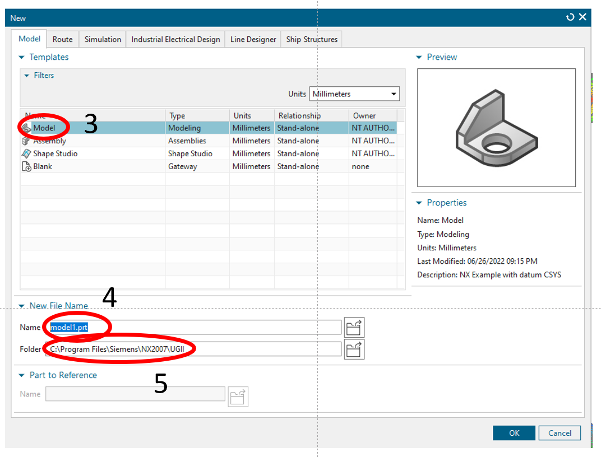

Figure 3: Creating a new model

### Creating geometry

Then you can create the geometry to given dimensions. Illustration of final geometry is given in figure 4.

    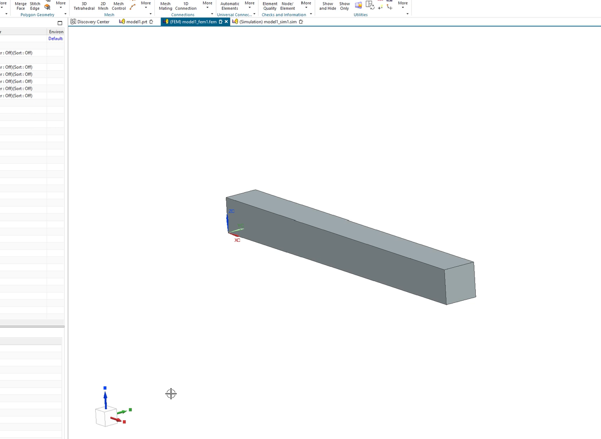

Figure 4 Creating geometry

### Creating FEM Simulation

Then "PrePost" can be enabled by following the steps illustrated in figure 5 by first clicking on "Application" and then clicking on "PrePost" on the top ribbon.

    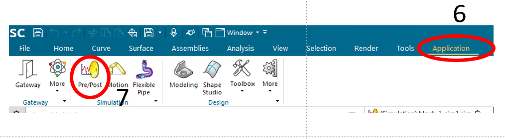

Figure 5: Activating pre-post

Thereafter, a FEM simulation can be created by clicking on "New FEM and Simulaion" as shown in the figure 6.

    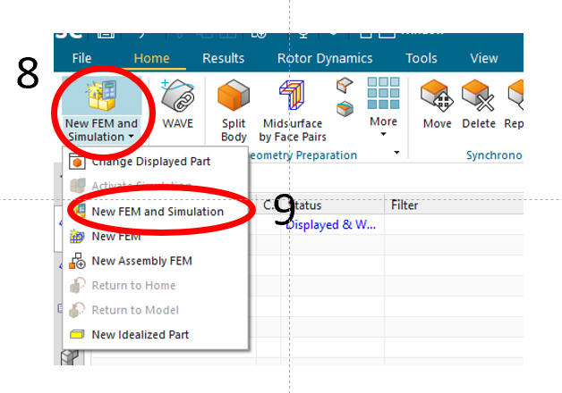

Figure 6: Selecting FEM Simulation

When you select "New FEM Simulation", following dialog box will appear as shown in figure 7. In there, "Solver" needs to be set to "Simcenter Nastran" and "Analysis Type" needs to be set to "Structural" as shown in step 10. Thereafter, select "Solution type" as "SOL 101: Linear Statics" to obtain a linear statics solution as in step 12. Then click "Ok" on the next dialog box.

    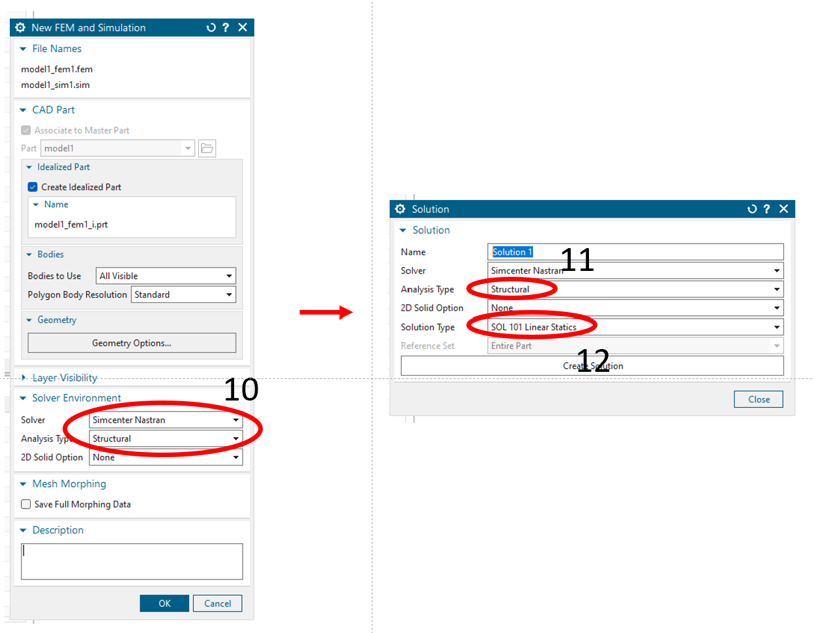

Figure 6: Creating FEM simulation

### Creating mesh

To create the mesh, first, the FEM model needs to be selected from "Simulation File View" by double clicking on the "model1_fem1" as shown in figure 7 step 13. Then "3D Tetrahedral" can be selected from the ribbon as in step 14. Then the the dialog box to the right in figure 7 appears. In there, "Object to Mesh" needs to selected with the whole body of your constructed geometry. Then tetrahedral element with 4 nodes needs to be selected as the element type in "Element Properties -> Type". This can be done by selecting "CTETRA(4)" in the options box as in step 16. Thereafter, "Element size" is put to "1mm" as shown in step 17. Onceyou press "Ok", then the mesh will be generated.

    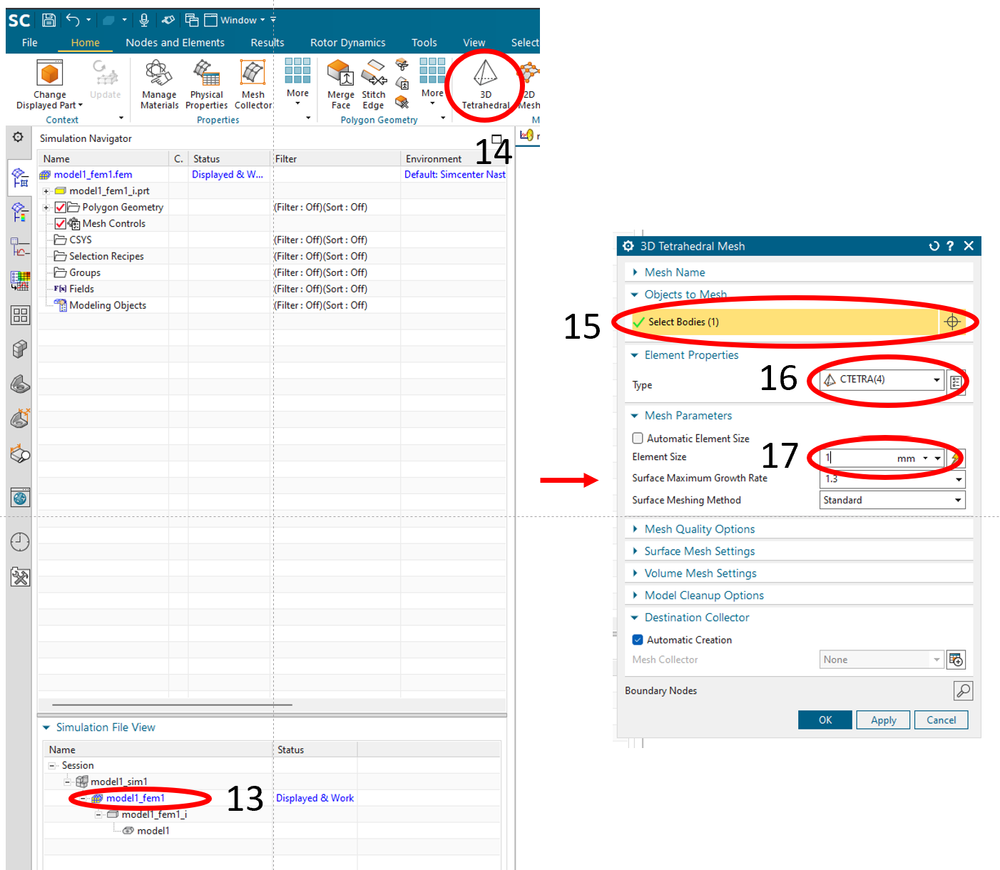

Figure 7: Creating mesh

The generated mesh will look like in figure 8.

    

Figure 8: Generated mesh

### Applying material properties

Figure 9 illstrates steps required to apply material "Auminium 2014" to the whole solid part of the fem model.

    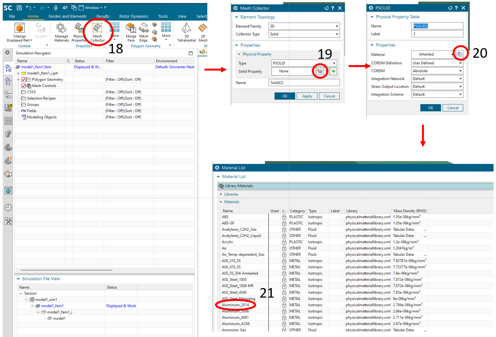

Figure 9: Applying materials

### Applying boundary conditions

Figure 10 illustrates the steps required to apply fixed boundary condition on the two end surfaces of the beam. Right figure of figure 10 shows the illustration after applying the fixed boundary conditions to two end square surfaces.

    

Figure 10: Applying fixed boundary condition

Figure 11 illustrates the steps required to apply force boundary condition on the top surface (normal to the "Z" direction). Right figure of figure 11 shows the illustration after applying the fixed boundary condition and force boundary condition.

    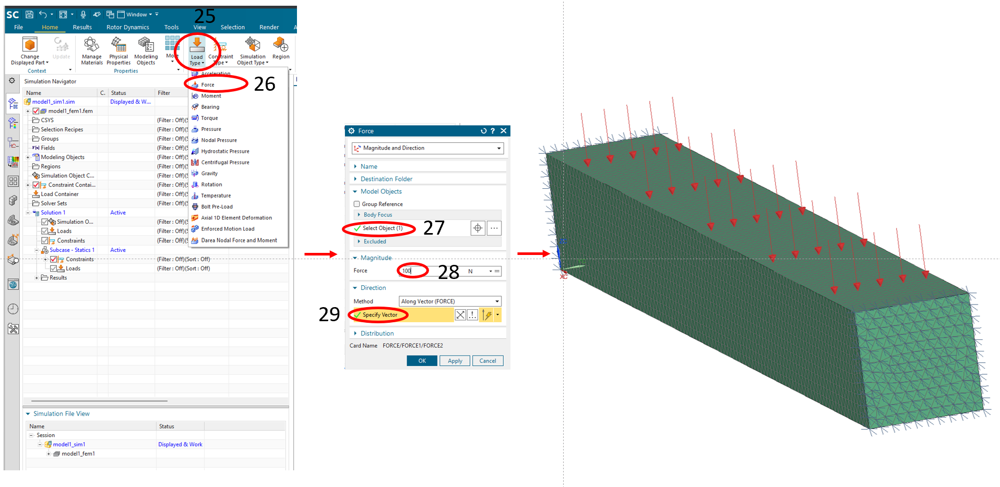

Figure 11: Applying force boundary condition

### Solving primal problem

Figure 12 illustrates steps required to solve the primal problem.

    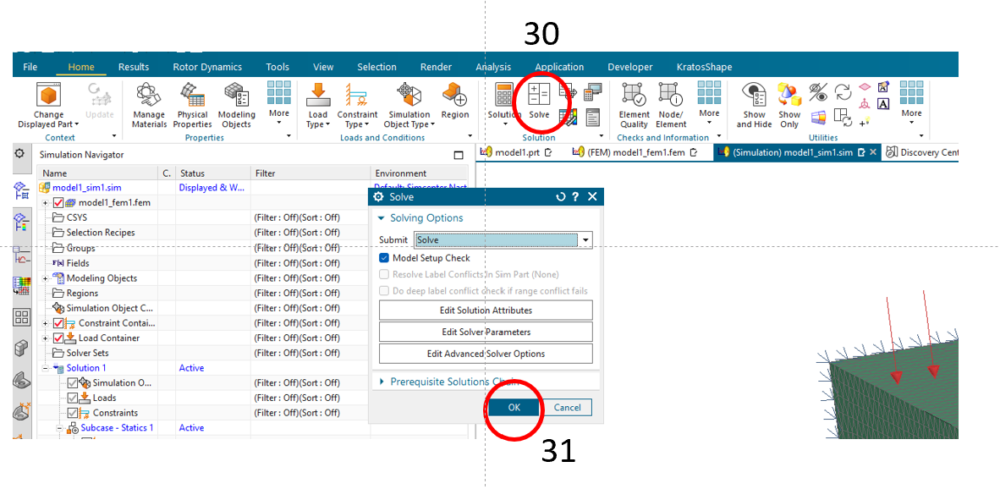

Figure 12: Running simulation

### Post processing

Figure 13 illustrates steps required to post process the primal problem.

    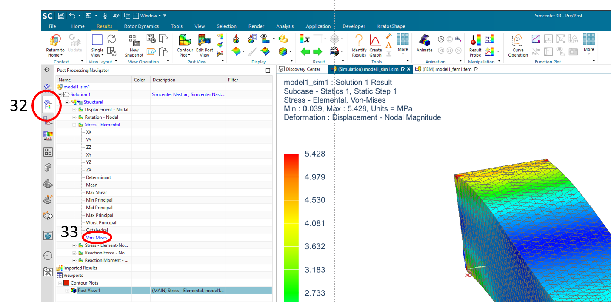

Figure 13: Post processing
