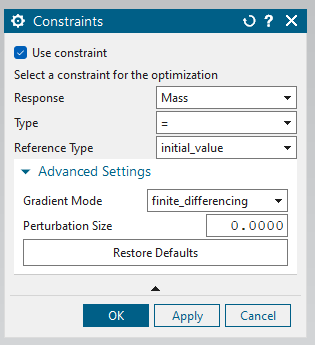

## Objectives and constraints availability

Depending on the selected `Reponse`, the `Advanced Settings` section may vary. Depending on the problem type defined as the primal, the available objectives also may vary. The following table illustrates availability of each objective under each analysis type.

| Analysis type | Solution type                                | Solution code | Available responses                                  |
|---------------|----------------------------------------------|---------------|------------------------------------------------------|
| Structural    | SOL 101 Linear Statics                       | SESTATIC 101  | [Mass](Responses/mass.html), [Strain Energy](Responses/strain_energy.html), [Kreisselmeier Aggregated Stress](Responses/kreisselmeier_aggregated_stress.html) |
| Structural    | SOL 101 Linear Statics                       | SEMODES 103   | [Mass](Responses/mass.html), [Eigen frequency](Responses/eigen_frequency.html)                                |
| Thermal       | SOL 153 Steady State Nonlinear Heat Transfer | NLSCSH 153    | [Mass](Responses/mass.html), [Average temperature](Responses/average_temperature.html)                            |

The `Gradient Mode` is also varying depending on the type of the objective. The `finite_differencing` method uses finite difference approach to calculate the sensitivities as explained in [Finite difference or direct approach](../General/Sensitivity_Analysis/Finite_difference_or_direct_approach.html). The `semi_analytic` method uses direct approach to calculate sensitivities of the objective with respect to state variables and uses finite difference approach to compute sensitivities with respect to nodal coordinates. Following table lists which approach is used in which objective when computing sensitivities. In the case of `finite_differencing` and `semi_analytic`, the `Perturbation Size` refers to the size of the perturbation which is used on each variable where `finite difference` approach is used.

| Response type                   | Gradient mode       |
|---------------------------------|---------------------|
| [Mass](Responses/mass.html)                            | Finite differencing |
| [Strain Energy](Responses/strain_energy.html)                 | Semi analytic       |
| [Kreisselmeier Aggregated Stress](Responses/kreisselmeier_aggregated_stress.html) | Semi analytic       |
| [Eigen frequency](Responses/eigen_frequency.html)                 | Semi analytic       |
| [Average temperature](Responses/average_temperature.html)             | Semi analytic       |

## Objectives interface

    

Figure 1: Objectives dialog box

The objectives interface is illustrated in Figure 1. The `Response` drop down box selects the main objective of the optimization. Thereafter, the type of the objective needs to be selected from the `Type` drop down box. There are mainly two types namely `minimization` and `maximization` representing optimization problems where minimizing of the objective and maximizing of the objective is of use respectively. The `maximization` optimization problems are converted to `minimization` problems by multiplying the given objective value by `-1`. (More details can be found about the exact implementations in the [objectives](../Technologies/Objectives.html) section.)

The `Advanced Settings` section includes specific settings required to properly construct the objectives (see [finite difference approach](../General/Sensitivity_Analysis/Finite_difference_or_direct_approach.html) and [adjoint approach](../General/Sensitivity_Analysis/Adjoint_approach.html) for more details)

## Constraints interface

    

Figure 2: Constraints dialog box

Use of constraints is alsways optional. In order to activate constraints, `Use constraints` needs to be checked. Once this is checked, user can select the `Response` and the `Type` and the `Reference Type`. These are explained in the following table.

`Response` drop down gives the available response function for the given analysis type. User is refered to table 1 to identify which response is available as a constraint for each of the analysis types.

`Type` referes to the type of the constraint. Following types are allowed.

| Type | Description|
|------|------------|
|=     | Equal to value given by `Reference Type`|
|<     | Less than the value given by `Reference Type` |
|>     | More than the value given by `Reference Type` |
|<=    | Less than or equal the value given by `Reference Type` |
|>=    | More than or equal the value given by `Reference Type` |

`Reference Type` has two options. `initial_value` referes to the initial value of the response to be used in the constraint as the value to be compared to. `specified_value` referes to a user specified value to be used in the construction of the constraints (refer to [constraints](../Technologies/Constraints.html) for more details of implementations).

The `Advanced Settings` section includes specific settings required to properly construct the constraints (see [finite difference approach](../General/Sensitivity_Analysis/Finite_difference_or_direct_approach.html) and [adjoint approach](../General/Sensitivity_Analysis/Adjoint_approach.html) for more details)
