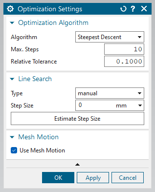
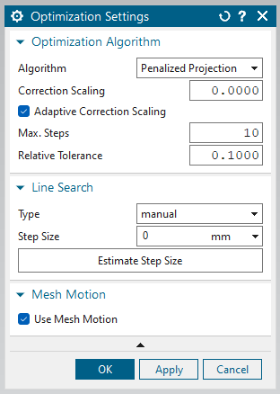

## Line search

Line search is used to determine the next shape update along the surface normal sensitivities direction which are computed from the adjoint solution.

Following settings can be found in the `Line search settings` section under the `Optimization settings`.

`Type` contains the methodologies supported in determining next search direction. Currently `manual` is the only methodology supported where surface normal sensitivities are normalized and afterwards they are applied with the manually specified step size (give by `Step size`) to obtain next shape update.

## Algorithms

Mainly there are two algorithms supported in the Siemens NX plugin. They are `Steepest descent` and `Penalized projection`. Following sections explain the settings found in each algorithm.

### Steepest descent

    

Figure 1: Steepest descent settings

### Penalized projection

    

Figure 1: Steepest descent settings
