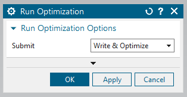

This section selects how to run the defined optimization problem.

## Run optimization dialog

    

Figure 1: Run optimization dialog box

|Option|Description|
|------|-----------|
|Submit| This descides the optimization problem submission type. **Write & Optimize**: This will write a new optimization files to be read by KratosMultiphysics, and then starts the optimization procedure.**Write Input File**: This will only write the input files which are used by KratosMultiphysics. **Optimize existing Input File**: This will not write a new input files for KratosMultiphysics, instead it will use the existing input files to start the otpimization procedure. |