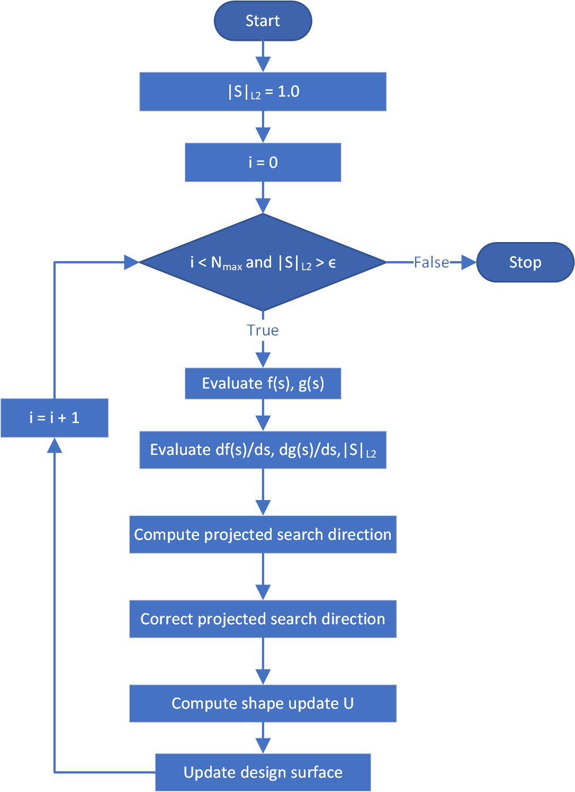

This is an algorithm used in determining shape update depending on the objectives and constraints. It can only be used with one objective and one constraint.

## Theory

This algorithm first converts objective and constraint values to [standardized objective](../Objectives.html#types-of-the-objective) (i.e. $$f_{std}$$) and [standardized constraint](../Constraints.html#constraint-formulation) (i.e. $$g_{std}$$). Then standardized objective gradient is computed with vertex morphing (i.e. $$\left(\frac{df}{d\underline{s}}\right)_{std}$$). Thereafter, if the given constraint is active, then the standardized constraint vertex morphed gradient is computed (i.e. $$\left(\frac{dg}{d\underline{s}}\right)_{std}$$).

If the constraint is inactive then, [steepest descent](steepest_descent.html) algorithm is used to compute the search direction and next shape update. Otherwise first [projected search direction](#projected-search-direction-computation) is computed. Thereafter a [correction](#projected-search-direction-correction) is made to the computed search direction.

### Projected search direction computation ([source](https://github.com/KratosMultiphysics/Kratos/blob/0048ec0790af5b356039ee4829d78ff0deb2d640/applications/ShapeOptimizationApplication/custom_utilities/optimization_utilities.cpp#L128))

If the constraint is active, then first the constraint sensitivity norm is calculated as given below.
<p align="center">$$ P = \sqrt{\sum_{\Omega} \left(\frac{dg}{d\underline{s}}\right)_{std}\cdot\left(\frac{dg}{d\underline{s}}\right)_{std} }$$</p>

Then projection of the objective gradient on to the constraint gradient is computed as following:
<p align="center">$$ Q = \sum_{\Omega} \left(\frac{df}{d\underline{s}}\right)_{std}\cdot\frac{\left(\frac{dg}{d\underline{s}}\right)_{std}}{P}$$</p>

Then the search direction is computed using the following equation:
<p align="center">$$ \underline{S} = - \left[\left(\frac{df}{d\underline{s}}\right)_{std} - \frac{Q}{P}\left(\frac{dg}{d\underline{s}}\right)_{std}\right]$$</p>

### Projected search direction correction ([source](https://github.com/KratosMultiphysics/Kratos/blob/0048ec0790af5b356039ee4829d78ff0deb2d640/applications/ShapeOptimizationApplication/custom_utilities/optimization_utilities.cpp#L172))

#### Computing correction scaling

A "Correction Scaling" factor (i.e. $$\alpha_{corscal}$$) is computed for each iteration seperately if "Adaptive correction scaling is used". Otherwise, the initial "Correction Scaling" factor is used in each design iteration of the optimization.

In the case of "Adaptive correction scaling", the "Correction Scaling" (i.e. $$\alpha_{corscal}^n$$) for current design iteration (i.e. $$n$$) is modified using the following methodology where $$g^n$$ represents current constraint value and $$g^{n-1}$$ represents previous constraint value.

<p align="center">$$ \alpha_{corscal}^n = \begin{cases} \frac{\alpha_{corscal}^{n-1}}{2} \quad &\textit{if}\quad g^n\times g^{n-1} < 0.0 \\2 \alpha_{corscal}^{n-1} \quad &\textit{if}\quad g^n\times g^{n-1} > 0.0 \quad \textit{and}\quad |g^n| > |g^{n-1}| \\ \alpha_{corscal}^{n-1} \quad &\textit{otherwise}  \end{cases}$$</p>

#### Computing projection correction ([source](https://github.com/KratosMultiphysics/Kratos/blob/0048ec0790af5b356039ee4829d78ff0deb2d640/applications/ShapeOptimizationApplication/custom_utilities/optimization_utilities.cpp#L190))

The correction factor (i.e. $$\alpha_{cor}$$) is calculated using the following equation:
<p align="center">$$ \alpha_{cor} = \alpha_{corscal}^{n} \frac{\sqrt{\sum_{\Omega} S\cdot S }}{g^n P}$$</p>

Then the computed correction factor is used to modify the search direction as given in the below equation:
<p align="center">$$ \underline{S} = \underline{S} - \alpha_{cor} g^n \left(\frac{dg}{d\underline{s}}\right)_{std}$$</p>

The normalized search direction is computed using the following equation.

<p align="center">$$ \underline{S}_{normalized} = \frac{1}{\lVert \underline{S} \rVert_{max}}S $$</p>

Afterwards, either $$ \underline{S} $$ or $$ \underline{S}_{normalized} $$ is used to compute the shape update as depicted in the following equations where $$ \delta s $$ is the step size.

<p align="center">$$ \underline{U} = \underline{S} \delta s $$</p>
<p align="center">$$ \underline{U} = \underline{S}_{normalized} \delta s $$</p>

Then this shape update is applied to change nordal coordinates of the design surface to obtain the updated and improved design surface.

## Algorithm

<p align="center">
    
</p>
<p align="center">Figure 1: Penalized projection algorithm</p>

## Usage in KratosMultiphysics

Following is an example list of settings which can be used with this algorithm.

```json
        {
            "name"                    : "penalized_projection",
            "correction_scaling"      : 1.0,
            "use_adaptive_correction" : true,
            "max_iterations"          : 100,
            "relative_tolerance"      : 1e-3,
            "line_search" : {
                "line_search_type"           : "manual_stepping",
                "normalize_search_direction" : true,
                "step_size"                  : 1.0,
                "estimation_tolerance"       : 0.1,
                "increase_factor"            : 1.1,
                "max_increase_factor"        : 10.0
            }
        }
```

Following table illustrates allowed values for each setting.

|Option|Allowed values|
| ------------- | ------------- |
|name| This should be "penalized_projection" in order to use this algorithm. |
|max_iterations| Number of iterations to be evaluated in this optimization problem. (i.e. $$N_{max}$$) |
|relative_tolerance| Relative tolerance which is accepted as convergence (i.e. $$ \epsilon $$). |
|correction_scaling| $$\alpha_{corscal}^{0}$$ value for "Correction scaling" |
|use_adaptive_correction| This will modify the initial $$\alpha_{corscal}^{0}$$ as described in [computing correction scaling](#computing-correction-scaling) section. |

### Line search settings

```json
                "line_search_type"           : "manual_stepping",
                "normalize_search_direction" : true,
                "step_size"                  : 1.0,
                "estimation_tolerance"       : 0.1,
                "increase_factor"            : 1.1,
                "max_increase_factor"        : 10.0
```

Following table illustrates allowed values for each setting.

|Option|Allowed values|
| ------------- | ------------- |
|line_search_type| "manual_stepping" or "adaptive_stepping". |
|step_size| Initial step size in "adaptive_stepping" or overall step size in "manual_stepping". |
|estimation_tolerance| Estimation tolerance for "adaptive_stepping". |
|increase_factor| Increment factor for the "adaptive_stepping". |
|increase_famax_increase_factorctor| Max increment factor allowed for the "adaptive_stepping". |

## Source

Location: ["applications/ShapeOptimizationApplication/python_scripts/algorithms/algorithm_penalized_projection.py"](https://github.com/KratosMultiphysics/Kratos/blob/shapeopt/kreisselmeier_aggregation/applications/ShapeOptimizationApplication/python_scripts/algorithms/algorithm_penalized_projection.py)