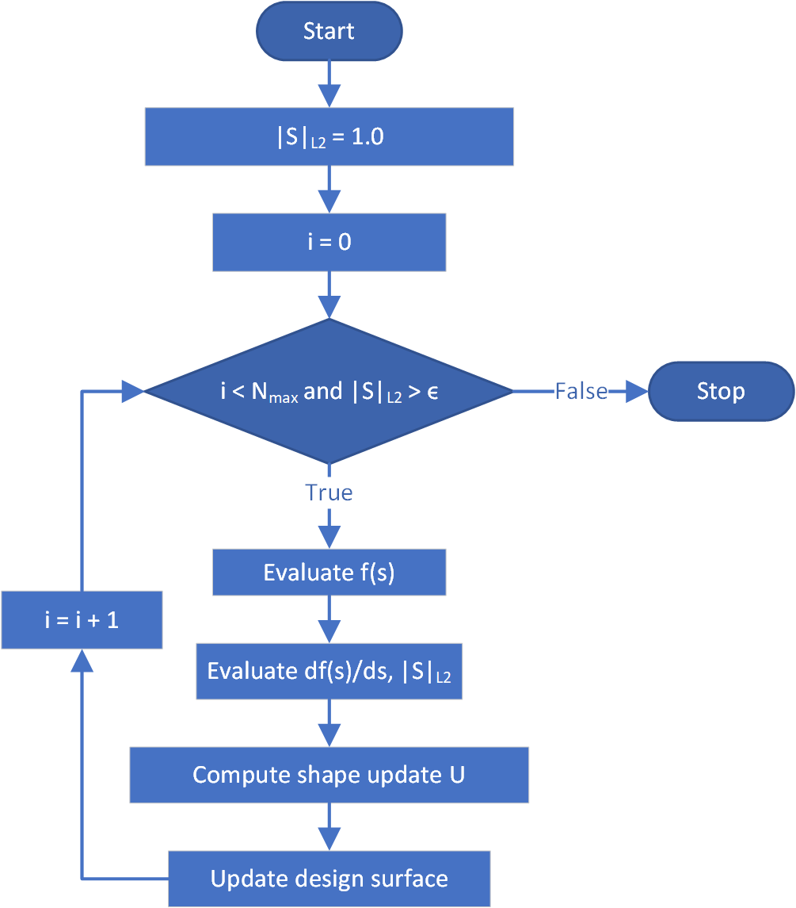

This is an algorithm used in determining shape update depending on the objectives only. Not applicable with constraints.

## Theory

This first computes the [standardized objective value](../Objectives.html#types-of-the-objective) (i.e. $$f_{std}$$) and the vertex morphed derivative of it with respect to the nodal coordinates (i.e. $$s$$). Then the negative vertex morphed sensitivivity (i.e. $$ -\left(\frac{df}{d\underline{s}}\right)_{std}$$) information of the objective (i.e. $$ f $$) w.r.t. design variables at each node (i.e. $$ \underline{s}$$) to determine the search direction as depicted in the following equation.

<p align="center">$$ \underline{S} = -\left(\frac{df}{d\underline{s}}\right)_{std} $$</p>

The normalized search direction is computed using the following equation.

<p align="center">$$ \underline{S}_{normalized} = -\frac{1}{\lVert \underline{S} \rVert_{max}}\left(\frac{df}{d\underline{s}}\right)_{std} $$</p>

Afterwards, either $$ \underline{S} $$ or $$ \underline{S}_{normalized} $$ is used to compute the shape update as depicted in the following equations where $$ \delta s $$ is the step size.

<p align="center">$$ \underline{U} = \underline{S} \delta s $$</p>
<p align="center">$$ \underline{U} = \underline{S}_{normalized} \delta s $$</p>

Then this shape update is applied to change nordal coordinates of the design surface to obtain the updated and improved design surface.

## Algorithm

<p align="center">
    
</p>
<p align="center">Figure 1: Steepest descent algorithm</p>

## Usage in KratosMultiphysics

Following is an example list of settings which can be used with this algorithm.

```json
        {
            "name"               : "steepest_descent",
            "max_iterations"     : 100,
            "relative_tolerance" : 1e-3,
            "gradient_tolerance" : 1e-5,
            "line_search" : {
                "line_search_type"           : "manual_stepping",
                "normalize_search_direction" : true,
                "step_size"                  : 1.0,
                "estimation_tolerance"       : 0.1,
                "increase_factor"            : 1.1,
                "max_increase_factor"        : 10.0
            }
        }
```

Following table illustrates allowed values for each setting.

|Option|Allowed values|
| ------------- | ------------- |
|name| This should be "steepest_descent" in order to use this algorithm. |
|max_iterations| Number of iterations to be evaluated in this optimization problem. (i.e. $$N_{max}$$) |
|relative_tolerance| Relative tolerance which is accepted as convergence (i.e. $$ \epsilon $$). |
|gradient_tolerance| Relative tolerance which is accepted as convergence (i.e. $$ \epsilon $$). |
|line_search| Settings to be used in line search. |

### Line search settings

```json
                "line_search_type"           : "manual_stepping",
                "normalize_search_direction" : true,
                "step_size"                  : 1.0,
                "estimation_tolerance"       : 0.1,
                "increase_factor"            : 1.1,
                "max_increase_factor"        : 10.0
```

Following table illustrates allowed values for each setting.

|Option|Allowed values|
| ------------- | ------------- |
|line_search_type| "manual_stepping" or "adaptive_stepping". |
|step_size| Initial step size in "adaptive_stepping" or overall step size in "manual_stepping". |
|estimation_tolerance| Estimation tolerance for "adaptive_stepping". |
|increase_factor| Increment factor for the "adaptive_stepping". |
|increase_famax_increase_factorctor| Max increment factor allowed for the "adaptive_stepping". |

## Source

Location: ["applications/ShapeOptimizationApplication/python_scripts/algorithms/algorithm_steepest_descent.py"](https://github.com/KratosMultiphysics/Kratos/blob/shapeopt/kreisselmeier_aggregation/applications/ShapeOptimizationApplication/python_scripts/algorithms/algorithm_steepest_descent.py)