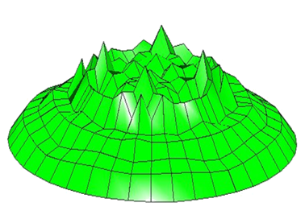
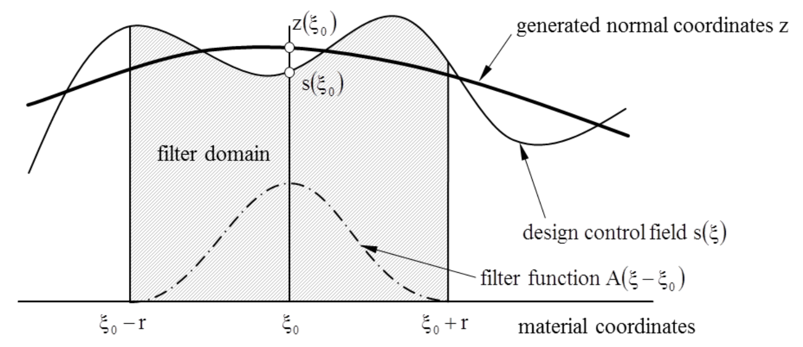

## Introduction

Vertex morphing is a filtering method to filter out noise present in a sensitivity field or design field. Noisy sensitivity field is a common challenge in optimization problems which makes updated designs non-intuitive. They also make the updated meshes based on updated design space with bad elements which eventually result in failure in primal and adjoint solution computation. Therefore it is crucial to apply a filtering technique to obtain a smooth sensitivity field. An example of a noisy field is shown in figure 1.

<p align="center">
    
</p>
<p align="center">Figure 1: Noisy design field</p>

### Definition

Figure 2 illustrates the filtering methodology applied in vertex morphing. Design control field (i.e. sensitivity field) is demonstrated by $$S\left(\xi\right)$$. Filtering domain is identified by the used $$r$$ filter radii for each mesh coordinate. Then a filtering function of $$A\left(\xi-\xi_0\right)$$ is applied on the filtering domain to obtain smoothened and filtered design control field of $$z\left(\xi_o\right)$$ as illustrated in the figure.

<p align="center">
    
</p>
<p align="center">Figure 2: Vertex morphing filtering</p>

Following equation is used to obtain the final filtered design control field.

<p align="center">$$ z\left(x_0\right) = \int_{x_0-r}^{x_0+r} A\left(x, x_0, r\right)s\left(x\right) d\Gamma $$</p>

Figure 2 illustrates obtained filtered and smoothened design field of the noist design field illustrated in figure 1.

<p align="center">
    
</p>
<p align="center">Figure 2: Filtered design field</p>

It is important to note that the variability of the resulting shape is characterized by the density of the design grid used to discretize the design control field $$s$$. The filter helps to control the continuity properties of the resulting shape. The filter does not affect the global and local solutions and leaves them unchanged. Typically, of course, in the case of non-convex problems different local solutions are found for different filters as they modify the descent directions. The design space and its variety of alternative local optima are easily explored with repeated optimization and varied filters.

### Effect of filter radii

Higher filter radii (i.e. $$r$$) results in smoothened design field over a circular area in 2D and a spherical area in 3D with radius $$r$$. It may loose the local effect which are significant in obtaining design field which is capable of optimizing the given objective(s). This is illustrated in figure 3. In there, green plot illustrates the noisy design field, blue plot illustrates filtered design field with $$r=4$$ and red plots illustrate filtered design fields with $$r=6$$ (left) and $$r=16$$ (right).

<p align="center">
    
</p>
<p align="center">Figure 3: Filter radii effect on smoothened design field</p>

## Usage in KratosMultiphysics

### Selection of filtering method

Filtering options in optimization problems can be found in the "optimization_parameters.json" file at the root of your optimization problem where it contains "optimization_settings" block. All the settings relevant for filtering is located at "optimization_settings/design_variables". Following is an example. Vertex morphing is the only filtering method allowed, therefore "type" should always be "vertex_morphing" even if you like to use the raw design field.

```json
{
    "type": "vertex_morphing",
    "filter": {}
}
```

| Option | Allowed values |
| ------------- | ------------- |
| type  | "vertex_morphing"  |
| filter  | [See](#vertex-morphing-options) |

[Source](https://github.com/KratosMultiphysics/Kratos/blob/master/applications/ShapeOptimizationApplication/python_scripts/optimizer_factory.py#L44-L45)

### Vertex morphing options

Example set of options are shown below

```json
{
    "filter_function_type"       : "linear",
    "filter_radius"              : 0.000000000001,
    "max_nodes_in_filter_radius" : 10000,
    "matrix_free_filtering"      : false,
    "consistent_mapping"         : false,
    "improved_integration"       : false,
    "integration_method"         : "area_weighted_sum"
}
```

Following table illustrates allowed values for each option.

| Option | Allowed values |
| ------------- | ------------- |
| filter_function_type  | ["gaussian"](#gaussian-filter-function), ["linear"](#linear-filter-function), ["constant"](#constant-filter-function), ["cosine"](#cosine-filter-function), ["quartic"](#quartic-filter-function)  |
| filter_radius  | [See](#effect-of-filter-radii) |
| max_nodes_in_filter_radius  | Number of maximum nodes to be considered within the filter radii. If the filter radii is large, then this number of closest neighbour points are used as the filter domain and rest of the nodes in the filter radius is ignored. |
| improved_integration  | true or false |
| integration_method  | ["area_weighted_sum"](#area-weighted-sum-integration-method), [Only works with "improved_integration": true, otherwise ignored.] |


#### Gaussian filter function ([source](https://github.com/KratosMultiphysics/Kratos/blob/0048ec0790af5b356039ee4829d78ff0deb2d640/applications/ShapeOptimizationApplication/custom_utilities/filter_function.cpp#L34))

<p align="center">$$ A\left(\mathbf{x},\mathbf{x_0},r\right)  = \max\left\lbrace 0.0, e^{\frac{-9\left|\mathbf{x}-\mathbf{x_0}\right|^2}{2r^2}}\right\rbrace$$</p>

#### Linear filter function ([source](https://github.com/KratosMultiphysics/Kratos/blob/0048ec0790af5b356039ee4829d78ff0deb2d640/applications/ShapeOptimizationApplication/custom_utilities/filter_function.cpp#L38))
<p align="center">$$ A\left(x,x_0,r\right)  = \max\left\lbrace 0.0, \frac{r-\left|\mathbf{x}-\mathbf{x_0}\right|}{r}\right\rbrace$$</p>

#### Constant filter function ([source](https://github.com/KratosMultiphysics/Kratos/blob/0048ec0790af5b356039ee4829d78ff0deb2d640/applications/ShapeOptimizationApplication/custom_utilities/filter_function.cpp#L42))
<p align="center">$$ A\left(x,x_0,r\right)   = 1.0$$</p>

#### Cosine filter function ([source](https://github.com/KratosMultiphysics/Kratos/blob/0048ec0790af5b356039ee4829d78ff0deb2d640/applications/ShapeOptimizationApplication/custom_utilities/filter_function.cpp#L46))
<p align="center">$$ A\left(x,x_0,r\right)   = \max\left\lbrace 0.0, 1-0.5\left(1-\cos\left(\pi\frac{\left|\mathbf{x}-\mathbf{x_0}\right|}{r}\right)\right)\right\rbrace$$</p>
<!-- [](double radius, double distance) {return std::max(0.0, );}; -->

#### Quartic filter function ([source](https://github.com/KratosMultiphysics/Kratos/blob/0048ec0790af5b356039ee4829d78ff0deb2d640/applications/ShapeOptimizationApplication/custom_utilities/filter_function.cpp#L50))
<p align="center">$$ A\left(x,x_0,r\right)   = \max\left\lbrace 0.0, \left(\frac{\left|\mathbf{x}-\mathbf{x_0}\right|-r}{r}\right)^4\right\rbrace$$</p>

#### Area weighted sum integration method

This method modifies chosen ``filter_function_type`` based on the nodal area averaging methodology. $$B\left(x, x_0, r\right)$$ is the nodal area of the neighbour node at $$x$$ position, $$N$$ is the number of neighbour nodes.

<p align="center">$$ A\left(x,x_0,r\right)   = A\left(x,x_0,r\right)\times \frac{B\left(x, x_0, r\right)}{\sum_{n=1}^{N}\left[B\left(x, x_0, r\right)\right]}$$</p>

## Algorithm

This vertex morphing algorithm is used to compute vertex morphed sensitivities of objectives and constraints. First, neighbour nodes for all the design surface nodes are found using a KDTree.

Then for each node's (i.e. $$i^{th}$$) neigbhour nodes (i.e. $$j^{th}$$) the weights are computed using filter functions mentioned above (i.e. $$A_{ij}$$). Thereafter, the vertex morphed sensitivities for each sensitivity is computed as given in the following equation.

<p align="center">$$ \left(\frac{df}{d\underline{s}}\right)_{i, morphed} = \frac{1}{\sum_{j=1}^N A_{ij}}\sum_{j=1}^{N} A_{ij}\left(\frac{df}{d\underline{s}}\right)_j$$</p>

## Source

Location: ["applications/ShapeOptimizationApplication/custom_utilities/mapping/mapper_vertex_morphing_matrix_free.h"](https://github.com/KratosMultiphysics/Kratos/blob/shapeopt/kreisselmeier_aggregation/applications/ShapeOptimizationApplication/custom_utilities/mapping/mapper_vertex_morphing_matrix_free.h)