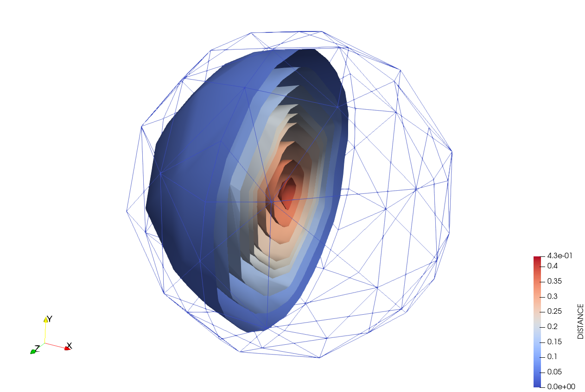

# Calculate nodal distance to skin



## Description

This process offers a robust solution for calculating the minimum distance from the nodes of a volume model part to a designated skin model part using the `GeometricalObjectBins` in order to compute the distance.

### Key Features

- **Mesh Compatibility**:  This ensures that it works with any type of mesh, current processes are focused in simplex meshes and usually compute signed distance (this distance is not signed) and it is more focus on the cut of elements.

- **Unsigned Distance Calculation**: Distance is unsigned and exclusively and solely calculated within the nodes.

- **Support for Historical and Non-Historical Data**: This process supports both historical and non-historical distance variables.

### Future Developments

The process is currently optimized for serial execution. However, plans are underway to enable distributed computation, contingent on the integration of improvements from [KratosMultiphysics/Kratos pull request #11719](https://github.com/KratosMultiphysics/Kratos/pull/11719).

## Execution

### `Execute`

`Execute` method is used to execute the Process algorithms.

This algorithm defines two lambda functions, `distance_lambda_historical` and `distance_lambda_non_historical`, for calculating the distance of nodes to the nearest geometrical object (element or condition) in a model part. It then determines which lambda to use based on whether the distance variable is historical or non-historical and applies the appropriate lambda to calculate the distances.

- **`distance_lambda_historical`**: This lambda function is used when working with historical data. It iterates over all nodes in the provided nods container and calculates the distance of each node to its nearest geometrical object using a spatial search. The calculated distance is then stored in the node's historical data.

- **`distance_lambda_non_historical`**: This lambda function is similar to `distance_lambda_historical` but is used for non-historical data. It also calculates the distance of each node to its nearest geometrical object and stores the result in the node's non-historical data container.

These lambdas functions will be chosen depending `distance_database` flag.

Both lambda functions take the following parameters:
- `Nodes`: A reference to the container holding the nodes for which distances will be calculated.
- `Bins`: A reference to an object of type `GeometricalObjectsBins`, which is used to perform efficient spatial searches for the nearest geometrical object to a given node.

The core of the distance calculation is performed by the `Bins.SearchNearest(Node)` call within each lambda. This function searches for the nearest geometrical object to the node and returns a search result object, from which the distance (`GetDistance()`) to the nearest object is retrieved and assigned to the node.

The selected lambda function is then applied to calculate the distances for all nodes in volumetric model part based on the geometrical objects (elements or conditions) found in skin model part. Before applying the lambda, the code checks whether to use elements or conditions from skin model part for the distance calculation, prioritizing elements if both exist.

#### ⚠️ Warning

> A warning is issued if both elements and conditions are found in the skin model part, indicating that elements will be considered for the distance calculation.

## Parameters & Defaults

```json
{
    "volume_model_part" : "",
    "skin_model_part"   : "",
    "distance_database" : "nodal_historical",
    "distance_variable" : "DISTANCE"
}
```

##### `volume_model_part`
Specifies the volume model part for the process. Absence of a value results in failure due to the default empty string.

##### `skin_model_part`
Defines the skin model part for distance computations. Like the volume model part, a default empty string necessitates explicit specification.

##### `distance_database`
This flag indicating whether historical variable is enabled or otherwise non-historical is considered. It is set by string, options are `nodal_historical` or `nodal_non_historical`. Default value is `nodal_historical`.

##### `distance_variable`
Denotes the variable for applying the process, with `DISTANCE` set as the default value.