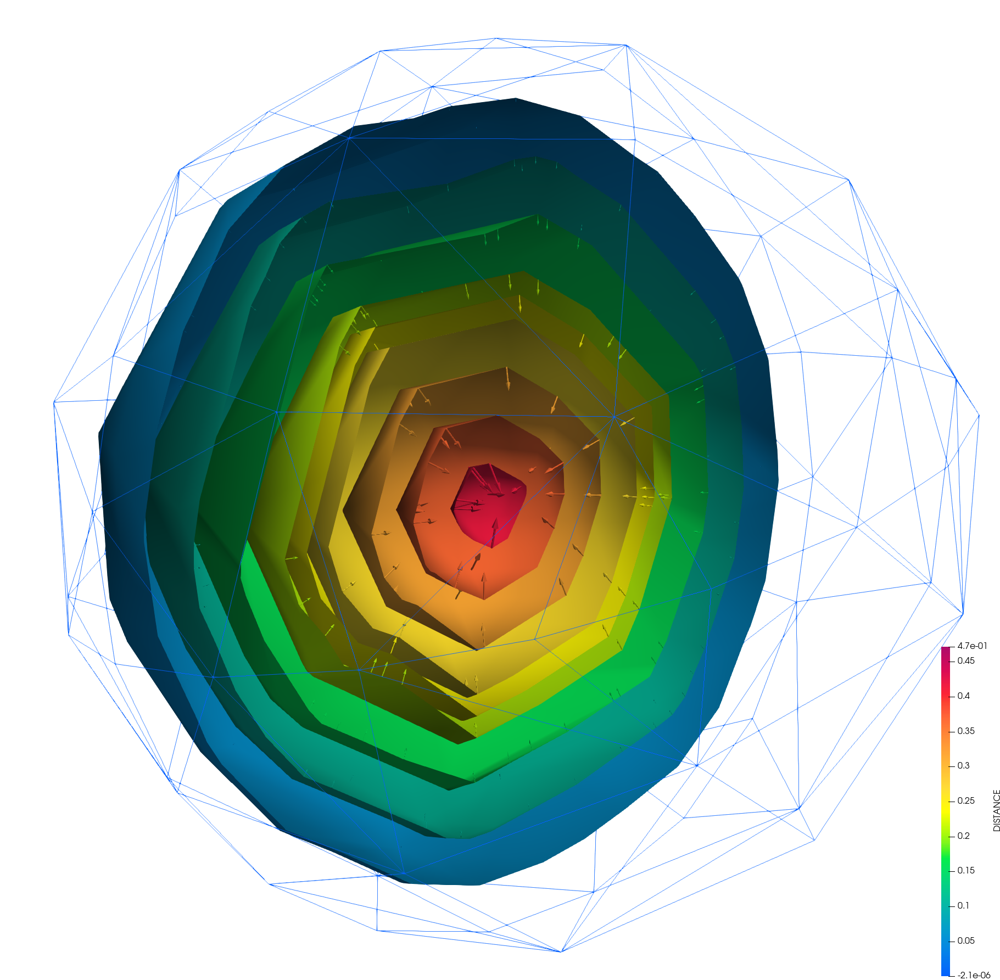

# Compute Nodal Gradient



## Description

This process is specifically designed for computing nodal gradients based on given input variables. Calculating gradients at nodes are fundamental in numerous physics simulations such as fluid dynamics, solid mechanics, and more.

Some key factors:

- **Historical vs. Non-Historical Data**: In Kratos, variables can be stored either as "historical," meaning they are associated with a time step, or "non-historical," which are not tied to a specific time step. This process supports both types, making it versatile for various simulation needs.
- **Parallelism**: The code makes extensive use of Kratos's parallel utilities, ensuring that the gradient computation is efficient and scalable across multiple cores or nodes in a **MPI** environment.

### The `ComputeNodalGradientProcess` constructors

- The `ComputeNodalGradientProcess` class is templated on a boolean `TOutputHistorical` to dictate whether the output variables are stored as historical or non-historical data in Kratos. This flexibility allows the process to be used in different contexts where either storage method is preferred.
- The class constructors offer multiple ways to initialize the process, either by passing a `Model` and `Parameters` object or by directly specifying the `ModelPart`, variables for origin, gradient, area, and a flag for non-historical variables.

### Member functions

- `PrepareMemberVariablesFromSettings`: Prepares member variables based on the input parameters.
- `CheckOriginAndAreaVariables`: Checks the existence of the origin and area variables in the model part.
- `ClearGradient`: Initializes or clears the gradient and area values at the start of the computation process.
- `Execute`: The main method that orchestrates the gradient computation by clearing existing gradients, computing elemental contributions, synchronizing the gradients across the model, and finally ponderating the gradient values based on the computed areas.
- `ComputeElementalContributionsAndVolume`: Calculates the contributions to the nodal gradients from each element and the associated nodal volumes.
- `SynchronizeGradientAndVolume`: Ensures that gradient and volume values are correctly synchronized across different parts of the model in a parallel computing context.
- `PonderateGradient`: Normalizes the computed gradients by the nodal areas to finalize the gradient computation.
- `GetDefaultParameters`: Provides a default set of parameters for the process, facilitating user customization and ensuring robust parameter handling.

Only common `Process` methods are available thought python, like `Execute` and `GetDefaultParameters`.

### Utility structures

- `VariableVectorRetriever`: A utility structure to abstract the retrieval of variable values in a manner consistent with whether they are stored historically or non-historically.

## Parameters & Defaults

```json
{
    "model_part_name"                : "PLEASE_DEFINE_A_MODEL_PART_NAME",
    "origin_variable"                : "PLEASE_DEFINE_A_VARIABLE",
    "gradient_variable"              : "PLEASE_DEFINE_A_VARIABLE",
    "area_variable"                  : "NODAL_AREA",
    "non_historical_origin_variable" :  false
}
```

##### `model_part_name`
Specifies the model part for the process. Absence of a value results in failure due to the default empty string.

##### `origin_variable`
Denotes the variable for applying the process. Variable must be a `double` one.

##### `gradient_variable`
Denotes the variable destination of the process. Variable must be a a 3 components (`array_1d<double, 3>`) one.

##### `area_variable`
Denotes the averaging variable for applying the process, with `NODAL_AREA` set as the default value. Variable must be a `double` one.

##### `non_historical_origin_variable`
Denotes if the input variable is historical or non-historical. Being by default historical, aka `false`.