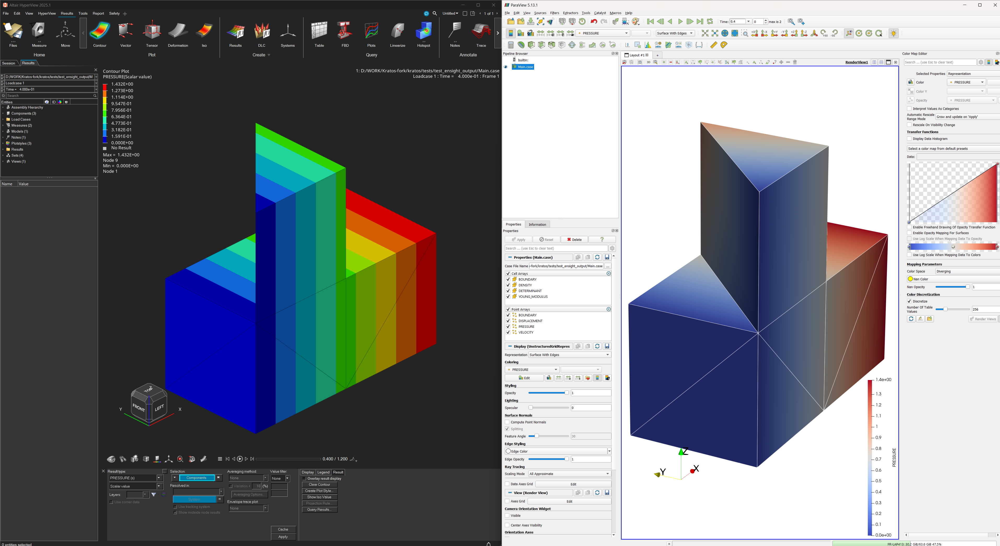

# EnSight Output Process

## Overview 📝

The **EnSight Output Process** is a powerful utility for exporting Kratos simulation results to the **EnSight 6/Gold** file format. This format is a standard in the engineering simulation world, particularly for CFD, and is well-suited for complex, multi-part models. The output consists of a set of files that describe the geometry, variables, and time evolution of the simulation, all managed by a central `.case` file.

This process enables high-fidelity post-processing and visualization using specialized software like **EnSight**, as well as other compatible tools such as **ParaView** and **Hyperview**.



The Python process serves as a user-friendly interface to the C++ `EnSightOutput` class, which handles the detailed logic of file creation and data formatting.

-----

## How it Works: The EnSight Format

Unlike single-file formats, an EnSight dataset is a collection of interconnected files:

  * **Case File (`.case`)**: The master file. It's a text file that describes the dataset's structure, referencing the geometry and variable files, and listing the time steps.
  * **Geometry File (`.geo`)**: Contains the mesh information—node coordinates and the connectivity of elements (or conditions) that form geometric "parts."
  * **Variable Files (`.scl`, `.vec`, `.ten`)**: These files store the simulation results for each time step. The extension indicates the data type:
      * `.scl`: Scalar values (e.g., PRESSURE, TEMPERATURE).
      * `.vec`: Vector values (e.g., DISPLACEMENT, VELOCITY).
      * `.ten`: Tensor values (e.g., STRESS\_TENSOR).

This multi-file, part-based structure is highly efficient for large models and is a key reason for its adoption in demanding simulation environments.

-----

## Configuration ⚙️

To use the EnSight Output Process, add it to the `output_processes` list in your project's parameters file. The configuration is very similar to that of other output processes like the `VtkOutputProcess`.

### Example Configuration

```json
"output_processes": {
    "ensight_output": [{
        "python_module": "ensight_output_process",
        "kratos_module": "KratosMultiphysics",
        "process_name": "EnSightOutputProcess",
        "Parameters": {
            "model_part_name": "MainModelPart.Fluid",
            "output_control_type": "step",
            "output_interval": 10,
            "ensight_file_format": "gold",
            "file_format": "ascii",
            "output_path": "ensight_results",
            "nodal_solution_step_data_variables": [
                "VELOCITY",
                "PRESSURE"
            ],
            "element_data_value_variables": [
                "VORTICITY"
            ]
        }
    }]
}
```

-----

## Parameters

The process is controlled by the following parameters:

```json
{
    "model_part_name"                             : "PLEASE_SPECIFY_MODEL_PART_NAME",
    "ensight_file_format"                         : "gold", // Options: "6", "gold"
    "file_format"                                 : "ascii", // Options: "ascii", "binary" // TODO: Check if binary is supported
    "output_precision"                            : 6,
    "step_label_precision"                        : 4,
    "output_control_type"                         : "step",
    "output_interval"                             : 1.0,
    "output_sub_model_parts"                      : false,
    "output_path"                                 : "EnSight_Output",
    "custom_name_prefix"                          : "",
    "custom_name_postfix"                         : "",
    "entity_type"                                 : "automatic",
    "save_output_files_in_folder"                 : true,
    "evolving_geometry"                           : true, // For meshes with evolving geometry
    "nodal_solution_step_data_variables"          : [],
    "nodal_data_value_variables"                  : [],
    "nodal_flags"                                 : [],
    "element_data_value_variables"                : [],
    "element_flags"                               : [],
    "condition_data_value_variables"              : [],
    "condition_flags"                             : [],
    "gauss_point_variables_extrapolated_to_nodes" : [],
    "gauss_point_variables_in_elements"           : []
}
```

| Parameter | Type | Description | Default Value |
| --- | --- | --- | --- |
| **`model_part_name`** | `String` | The name of the model part to be written. **This must be specified.** | `"PLEASE_SPECIFY_MODEL_PART_NAME"` |
| `ensight_file_format` | `String` | The specific EnSight format version. Options: <br> • **`"gold"`**: The modern, more capable format. <br> • **`"6"`**: An older, widely supported version. | `"gold"` |
| `file_format` | `String` | The format for the geometry and variable files. Options: <br> • **`"ascii"`**: Human-readable text format, useful for debugging. <br> • **`"binary"`**: More compact and efficient. *(Note: Binary support may be under development)*. | `"ascii"` |
| `output_precision` | `Integer` | The number of decimal places for floating-point values in `"ascii"` format. **Must not exceed 6.** | `6` |
| `step_label_precision`| `Integer` | The number of digits used for the step/time label in filenames (e.g., `4` results in `0001`, `0002`, ...). | `4` |
| `output_control_type` | `String` | The criterion for triggering output. Options: <br> • **`"step"`**: Output is based on the simulation step count. <br> • **`"time"`**: Output is based on the simulation time. | `"step"` |
| `output_interval` | `Double` | The frequency of output based on the `output_control_type`. | `1.0` |
| `output_sub_model_parts` | `Boolean` | If `true`, a separate geometric part will be generated for each sub-model part of the specified `model_part_name`. | `false` |
| `output_path` | `String` | The directory where the EnSight dataset (all files) will be saved. | `"EnSight_Output"` |
| `custom_name_prefix`| `String` | A custom prefix to add to the beginning of the base output filename. | `""` |
| `custom_name_postfix`| `String` | A custom suffix to add to the end of the base output filename. | `""` |
| `entity_type` | `String` | Specifies which entity type to write. Options: <br> • **`"element"`**: Writes elements. <br> • **`"condition"`**: Writes conditions. <br> • **`"automatic"`**: If both exist, it defaults to writing **only elements**. | `"automatic"` |
| `save_output_files_in_folder` | `Boolean` | If `true`, files are saved inside the directory specified by `output_path`. | `true` |
| `evolving_geometry` | `Boolean` | If `true`, a new geometry file (`.geo`) is written for every time step. If `false`, a single geometry file is written at the beginning, assuming the mesh does not change. | `true` |
| `nodal_solution_step_data_variables` | `List[String]` | A list of nodal variable names from the **historical database** to include in the output. | `[]` |
| `nodal_data_value_variables` | `List[String]` | A list of nodal variable names from the **non-historical database** to include in the output. | `[]` |
| `nodal_flags` | `List[String]` | A list of nodal flags to be written as scalar integer fields. | `[]` |
| `element_data_value_variables` | `List[String]` | A list of element variables from the non-historical database to include in the output. | `[]` |
| `element_flags` | `List[String]` | A list of element flags to be written. | `[]` |
| `condition_data_value_variables` | `List[String]` | A list of condition variables from the non-historical database to include in the output. | `[]` |
| `condition_flags` | `List[String]` | A list of condition flags to be written. | `[]` |
| `gauss_point_variables_extrapolated_to_nodes` | `List[String]` | A list of Gauss point variable names to be extrapolated to nodes and written as nodal results. | `[]` |
| `gauss_point_variables_in_elements` | `List[String]` | A list of Gauss point variable names to be written as a single, averaged value for each element. | `[]` |

-----

## Technical Notes 💡

  - **Variable Types**: The process automatically determines whether a variable is a scalar, vector, or symmetric tensor and writes it to the appropriate file type (`.scl`, `.vec`, `.ten`).
  - **Quadratic Geometries**: For correct visualization, the node ordering (connectivity) of certain quadratic geometries like `Hexahedra3D20` and `Prism3D15` is automatically reordered to match the EnSight format.
  - **Current Limitations**: As of the initial implementation, the binary output format may not be fully stable. ASCII format is recommended for production use.