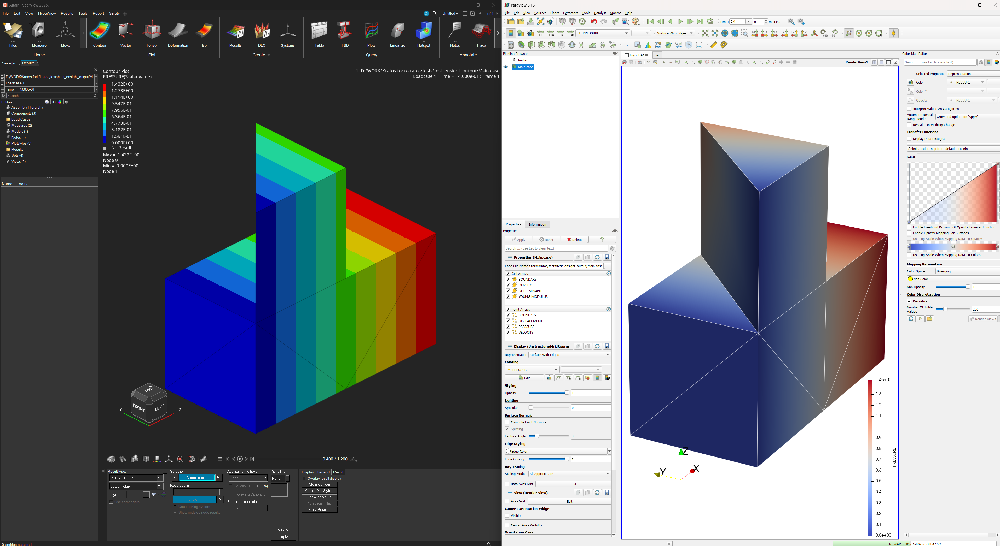

# EnSight Output Process

## Overview 📝

The **EnSight Output Process** exports Kratos simulation results to the **EnSight** file format (versions 5, 6, and Gold). This format is a standard in engineering simulation, particularly for CFD, and is well-suited for complex, multi-part models. The output consists of a set of files describing geometry, variables, and time evolution, all managed by a central `.case` file.

Results can be visualized in **EnSight**, **ParaView**, and **Hyperview** (as well as any other tool with EnSight reader support), using either ASCII or binary output.



The Python process serves as a user-friendly interface to the C++ `EnSightOutput` class, which handles the detailed logic of file creation and data formatting.

-----

## How it Works: The EnSight Format

An EnSight dataset is a collection of interconnected files:

- **Case File (`.case`)**: The master text file. References the geometry and variable files and lists the time steps.
- **Geometry File (`.geo`)**: Contains mesh information — node coordinates and element/condition connectivity organized into geometric "parts."
- **Variable Files**: Store simulation results for each time step. The extension indicates the data type:
  - `.scl` — Scalar values (e.g., `PRESSURE`, `TEMPERATURE`)
  - `.vec` — Vector values (e.g., `DISPLACEMENT`, `VELOCITY`)
  - `.ten` — Tensor values, both symmetric (e.g., `CAUCHY_STRESS_TENSOR`) and asymmetric (e.g., `DEFORMATION_GRADIENT`)

Both **ASCII** and **binary** output are fully supported. Binary files begin with the mandatory `C Binary` 80-byte header required by the EnSight specification and use IEEE 754 single-precision floats for all numeric data, making them compatible with all compliant readers including Hyperview.

-----

## Format Versions

Three EnSight format versions are supported via the `ensight_file_format` parameter:

| Value | Description |
|---|---|
| `"5"` | EnSight 5 — oldest format; coordinates written per-part; node connectivity uses local (part-level) IDs |
| `"6"` | EnSight 6 — global coordinate block at file level; references into the global coordinate list |
| `"gold"` | EnSight Gold — most capable modern format; per-part coordinate arrays; includes bounding-box `extents` block; distinct binary layout |

> **Recommendation**: Use `"gold"` for new projects. It is the most widely supported modern format and handles large, multi-part models most efficiently.

-----

## Configuration ⚙️

To use the EnSight Output Process, add it to the `output_processes` list in your project's parameters file. The configuration is very similar to that of other output processes like the `VtkOutputProcess`.

### Example Configuration

```json
"output_processes": {
    "ensight_output": [{
        "python_module": "ensight_output_process",
        "kratos_module": "KratosMultiphysics",
        "process_name": "EnSightOutputProcess",
        "Parameters": {
            "model_part_name": "MainModelPart.Fluid",
            "output_control_type": "step",
            "output_interval": 10,
            "ensight_file_format": "gold",
            "file_format": "ascii",
            "output_path": "ensight_results",
            "nodal_solution_step_data_variables": [
                "VELOCITY",
                "PRESSURE"
            ],
            "element_data_value_variables": [
                "CAUCHY_STRESS_TENSOR"
            ]
        }
    }]
}
```

-----

## Parameters

### Full Default Parameter Block

```json
{
    "model_part_name"                             : "PLEASE_SPECIFY_MODEL_PART_NAME",
    "ensight_file_format"                         : "gold",
    "file_format"                                 : "ascii",
    "output_precision"                            : 6,
    "step_label_precision"                        : 4,
    "output_control_type"                         : "step",
    "output_interval"                             : 1.0,
    "output_sub_model_parts"                      : false,
    "output_path"                                 : "EnSight_Output",
    "custom_name_prefix"                          : "",
    "custom_name_postfix"                         : "",
    "entity_type"                                 : "automatic",
    "save_output_files_in_folder"                 : true,
    "evolving_geometry"                           : true,
    "use_local_ids"                               : false,
    "nodal_solution_step_data_variables"          : [],
    "nodal_data_value_variables"                  : [],
    "nodal_flags"                                 : [],
    "element_data_value_variables"                : [],
    "element_flags"                               : [],
    "condition_data_value_variables"              : [],
    "condition_flags"                             : [],
    "gauss_point_variables_extrapolated_to_nodes" : [],
    "gauss_point_variables_in_elements"           : []
}
```

### Parameter Reference

| Parameter | Type | Description | Default |
|---|---|---|---|
| **`model_part_name`** | `String` | Name of the model part to write. **Must be specified.** | `"PLEASE_SPECIFY_MODEL_PART_NAME"` |
| `ensight_file_format` | `String` | EnSight format version: `"5"`, `"6"`, or `"gold"`. See [Format Versions](#format-versions). | `"gold"` |
| `file_format` | `String` | File encoding: `"ascii"` for human-readable text, `"binary"` for compact binary (IEEE 754 single-precision, 80-byte string records). Both are fully supported. | `"ascii"` |
| `output_precision` | `Integer` | Decimal places for floating-point values in ASCII output. Maximum is `6` (EnSight format limitation). | `6` |
| `step_label_precision` | `Integer` | Number of digits in the step counter in filenames (e.g., `4` → `0001`, `0002`, …). | `4` |
| `output_control_type` | `String` | Output trigger: `"step"` based on simulation step count, `"time"` based on simulation time. | `"step"` |
| `output_interval` | `Double` | Frequency of output relative to `output_control_type`. | `1.0` |
| `output_sub_model_parts` | `Boolean` | When `true`, each sub-model part is written as a separate geometric part. | `false` |
| `output_path` | `String` | Directory where all output files are saved. | `"EnSight_Output"` |
| `custom_name_prefix` | `String` | Prefix prepended to the base output filename. | `""` |
| `custom_name_postfix` | `String` | Suffix appended to the base output filename. | `""` |
| `entity_type` | `String` | Which entity type to write: `"element"`, `"condition"`, or `"automatic"` (elements take precedence when both exist). | `"automatic"` |
| `save_output_files_in_folder` | `Boolean` | When `true`, all files are placed inside `output_path`. | `true` |
| `evolving_geometry` | `Boolean` | When `true`, a new `.geo` file is written every output step. When `false`, a single geometry file is written at initialization (static mesh). | `true` |
| `use_local_ids` | `Boolean` | When `true`, nodes and elements are assigned sequential 1-based per-part IDs (`node id assign` / `element id assign`) instead of global Kratos IDs (`node id given` / `element id given`). Useful when global IDs are non-contiguous or very large. | `false` |
| `nodal_solution_step_data_variables` | `List[String]` | Nodal variables from the **historical** database. | `[]` |
| `nodal_data_value_variables` | `List[String]` | Nodal variables from the **non-historical** database. | `[]` |
| `nodal_flags` | `List[String]` | Nodal flags, written as scalar integer (0/1) fields. | `[]` |
| `element_data_value_variables` | `List[String]` | Element variables from the non-historical database. | `[]` |
| `element_flags` | `List[String]` | Element flags, written as scalar integer fields. | `[]` |
| `condition_data_value_variables` | `List[String]` | Condition variables from the non-historical database. | `[]` |
| `condition_flags` | `List[String]` | Condition flags, written as scalar integer fields. | `[]` |
| `gauss_point_variables_extrapolated_to_nodes` | `List[String]` | Gauss point variables extrapolated to nodes and written as nodal results. | `[]` |
| `gauss_point_variables_in_elements` | `List[String]` | Gauss point variables averaged per element and written as element results. | `[]` |

-----

## Variable Types and Output Files

The process automatically determines the type of each variable from the Kratos variable registry and selects the correct output file and `.case` keyword:

| Variable Type | C++ Type | File Extension | Case File Keyword |
|---|---|---|---|
| Scalar | `double`, `int`, `bool` | `.scl` | `scalar per node/element` |
| Vector | `array_1d<double,3>`, `Vector` (size 3) | `.vec` | `vector per node/element` |
| Symmetric Tensor | `Matrix` (3×3 sym.), `array_1d<double,6>`, `Vector` (size 6) | `.ten` | `tensor per node/element` |
| Asymmetric Tensor | `Matrix` (3×3 general), `array_1d<double,9>`, `Vector` (size 9) | `.ten` | `tensor asym per node/element` |

Symmetric tensor components are reordered from Kratos Voigt notation (11, 22, 33, 12, **23, 13**) to EnSight ordering (11, 22, 33, 12, **13, 23**) automatically. Asymmetric tensors are written in row-major order: 11, 12, 13, 21, 22, 23, 31, 32, 33.

-----

## Technical Notes 💡

- **Binary Format**: Every binary file begins with the mandatory 80-byte `C Binary` identifier. All string records are exactly 80 bytes (null-padded). All numeric data uses 32-bit types: `int32` for integers and `float32` for floating-point values. These conventions ensure full compatibility with EnSight, ParaView, and Hyperview.

- **EnSight Gold Binary Layout**: In Gold binary mode, the geometry file includes an `extents` record with the bounding box immediately after the `element id` line. For each element block, IDs are written as a contiguous `int32` array followed by a flat connectivity array — not interleaved per-element as in ASCII.

- **Quadratic Geometries**: Node connectivity for `Hexahedra3D20` and `Prism3D15` is automatically reordered to match the EnSight node numbering convention.

- **Local vs. Global IDs**: Use `"use_local_ids": true` when global Kratos node/element IDs are non-contiguous or very large, which can cause issues with some readers. Local IDs use sequential 1-based indices per part and write `node id assign` / `element id assign` in the geometry header.

- **Entity Precedence**: When a model part contains both elements and conditions and `entity_type` is `"automatic"`, elements take precedence and conditions are ignored with a warning.