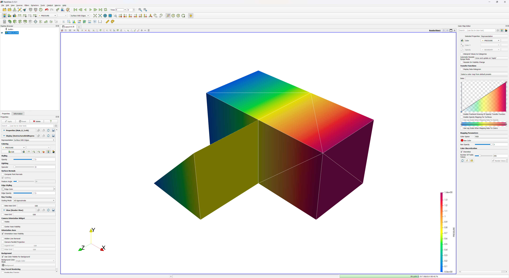

# VTK Output Process



## Overview 📝

The **VTK Output Process** is a core utility in Kratos for generating simulation outputs in the legacy VTK file format (`.vtk`). These files contain an unstructured grid representation of your model's mesh (nodes and connectivity) along with specified result variables. This format is widely supported and ideal for post-processing and visualization in software like **ParaView** and **VisIt**.

Behind the scenes, this Python process is a convenient wrapper for the powerful C++ `VtkOutput` class, which handles the low-level file writing operations.

-----

## Configuration ⚙️

To use the VTK Output Process, add it to the `output_processes` list within your project's parameters file. The process is configured through a JSON object.

### Example Configuration

Here is a typical configuration block:

```json
"output_processes": {
    "vtk_output": [{
        "python_module": "vtk_output_process",
        "kratos_module": "KratosMultiphysics",
        "process_name": "VtkOutputProcess",
        "Parameters": {
            "model_part_name": "MainModelPart.Structure",
            "output_control_type": "step",
            "output_interval": 1,
            "file_format": "binary",
            "output_path": "vtk_simulation_output",
            "nodal_solution_step_data_variables": [
                "DISPLACEMENT",
                "VELOCITY"
            ],
            "element_data_value_variables": [
                "VON_MISES_STRESS"
            ]
        }
    }]
}
```

-----

## Parameters

The process is controlled by the following parameters:

```json
{
    "model_part_name"                             : "PLEASE_SPECIFY_MODEL_PART_NAME",
    "file_format"                                 : "binary",
    "output_precision"                            : 7,
    "output_control_type"                         : "step",
    "output_interval"                             : 1.0,
    "output_sub_model_parts"                      : false,
    "output_path"                                 : "VTK_Output",
    "custom_name_prefix"                          : "",
    "custom_name_postfix"                         : "",
    "save_output_files_in_folder"                 : true,
    "entity_type"                                 : "automatic",
    "write_deformed_configuration"                : false,
    "write_ids"                                   : false,
    "nodal_solution_step_data_variables"          : [],
    "nodal_data_value_variables"                  : [],
    "nodal_flags"                                 : [],
    "element_data_value_variables"                : [],
    "element_flags"                               : [],
    "condition_data_value_variables"              : [],
    "condition_flags"                             : [],
    "gauss_point_variables_extrapolated_to_nodes" : [],
    "gauss_point_variables_in_elements"           : []
}
```

| Parameter                                     | Type                             | Description                                                                                                                                                                                                                                                                                                                    | Default Value                          |
| --------------------------------------------- | -------------------------------- | ------------------------------------------------------------------------------------------------------------------------------------------------------------------------------------------------------------------------------------------------------------------------------------------------------------------------------ | -------------------------------------- |
| **`model_part_name`** | `String`                         | The name of the model part to be written to the output file. **This must be specified.** | `"PLEASE_SPECIFY_MODEL_PART_NAME"`     |
| `file_format`                                 | `String`                         | The format of the VTK file. Options: <br> • **`"binary"`**: Smaller file size, faster to write/read. <br> • **`"ascii"`**: Human-readable text format, useful for debugging.                                                                                                                                                       | `"binary"`                             |
| `output_precision`                            | `Integer`                        | The number of decimal places for floating-point values. **Only applicable for the `"ascii"` format.** | `7`                                    |
| `output_control_type`                         | `String`                         | Determines the criterion for triggering output. Options: <br> • **`"step"`**: Output is based on the simulation step count. <br> • **`"time"`**: Output is based on the simulation time. <br> ⚠️ **Important**: When using `"time"`, ParaView may not be able to automatically group files into a time series. | `"step"`                               |
| `output_interval`                             | `Double`                         | The frequency of output based on the `output_control_type`. For example, if the control type is `"step"` and the interval is `10.0`, an output is written every 10 steps.                                                                                                                                                          | `1.0`                                  |
| `output_sub_model_parts`                      | `Boolean`                        | If `true`, a separate VTK file will be generated for each sub-model part of the specified `model_part_name`.                                                                                                                                                                                                                     | `false`                                |
| `output_path`                                 | `String`                         | The directory where output files will be saved. If it doesn't exist, it will be created.                                                                                                                                                                                                                                       | `"VTK_Output"`                         |
| `custom_name_prefix`                          | `String`                         | A custom prefix to add to the beginning of each output filename.                                                                                                                                                                                                                                                               | `""`                                   |
| `custom_name_postfix`                         | `String`                         | A custom suffix to add to the end of each output filename (before the time/step label).                                                                                                                                                                                                                                        | `""`                                   |
| `save_output_files_in_folder`                 | `Boolean`                        | If `true`, files are saved inside the directory specified by `output_path`. If `false`, `output_path` is treated as a filename prefix. This is useful in MPI to avoid folder creation conflicts.                                                                                                                                | `true`                                 |
| `entity_type`                                 | `String`                         | Specifies which entity type to write. Options: <br> • **`"element"`**: Writes elements. <br> • **`"condition"`**: Writes conditions. <br> • **`"automatic"`**: If the model part has both elements and conditions, it will default to writing **only the elements**. | `"automatic"`                          |
| `write_deformed_configuration`                | `Boolean`                        | If `true`, the mesh is written in its current, deformed configuration (using node coordinates). If `false`, it's written in its initial configuration (using `InitialPosition`).                                                                                                                                              | `false`                                |
| `write_ids`                                   | `Boolean`                        | If `true`, the Kratos IDs of entities are written as data fields (e.g., `KRATOS_NODE_ID`, `KRATOS_ELEMENT_ID`).                                                                                                                                                                                                                  | `false`                                |
| `nodal_solution_step_data_variables`          | `List[String]`                   | A list of nodal variable names from the **historical database** (solution step data) to be included in the output.                                                                                                                                                                                                             | `[]`                                   |
| `nodal_data_value_variables`                  | `List[String]`                   | A list of nodal variable names from the **non-historical database** (`DataValueContainer`) to be included in the output.                                                                                                                                                                                                       | `[]`                                   |
| `nodal_flags`                                 | `List[String]`                   | A list of nodal flags (e.g., `"SLIP"`, `"INTERFACE"`) to be written as integer fields (1 if true, 0 if false).                                                                                                                                                                                                                 | `[]`                                   |
| `element_data_value_variables`                | `List[String]`                   | A list of element variable names from the non-historical database to be included in the output.                                                                                                                                                                                                                               | `[]`                                   |
| `element_flags`                               | `List[String]`                   | A list of element flags to be written.                                                                                                                                                                                                                                                                                         | `[]`                                   |
| `condition_data_value_variables`              | `List[String]`                   | A list of condition variable names from the non-historical database to be included in the output.                                                                                                                                                                                                                             | `[]`                                   |
| `condition_flags`                             | `List[String]`                   | A list of condition flags to be written.                                                                                                                                                                                                                                                                                       | `[]`                                   |
| `gauss_point_variables_extrapolated_to_nodes` | `List[String]`                   | A list of Gauss point variable names to be extrapolated to the nodes and written as nodal results. This uses the `IntegrationValuesExtrapolationToNodesProcess` internally.                                                                                                                                                    | `[]`                                   |
| `gauss_point_variables_in_elements`           | `List[String]`                   | A list of Gauss point variable names to be written as a single, averaged value for each element/condition.                                                                                                                                                                                                                      | `[]`                                   |

### File Naming Convention

The output files are named according to the following pattern:
`{prefix}{model_part_name}{postfix}_{mpi_rank}_{label}.vtk`

  - **`prefix`**: From `custom_name_prefix`.
  - **`model_part_name`**: From `model_part_name`.
  - **`postfix`**: From `custom_name_postfix`.
  - **`mpi_rank`**: The rank of the MPI process (0 in serial).
  - **`label`**: The current step or time, formatted with the specified precision.

-----

## Deprecated Parameters 🔄

To maintain consistency, some older parameter names have been updated. The process will automatically handle these changes with a warning, but it's recommended to update your input files.

  - `output_frequency` is now **`output_interval`**.
  - `folder_name` is now **`output_path`**.
  - `write_properties_id` has been deprecated in favor of **`write_ids`**.

-----

## Technical Notes 💡

  - **File Format Reference**: This process generates files according to the VTK legacy unstructured grid format. The official specification can be found on the [VTK website](https://www.vtk.org/wp-content/uploads/2015/04/file-formats.pdf).
  - **Quadratic Geometries**: For correct visualization, the node ordering (connectivity) of certain quadratic geometries like `Hexahedra3D20`, `Hexahedra3D27`, and `Prism3D15` is automatically reordered to match VTK's expected format.
  - **Parallel Execution (MPI)**: In an MPI simulation, each processor writes its own partition of the model part to a separate `.vtk` file. You can open these file series in ParaView (e.g., `filename_..._..vtk`) to visualize the entire domain.