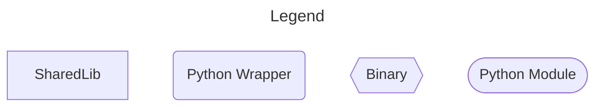
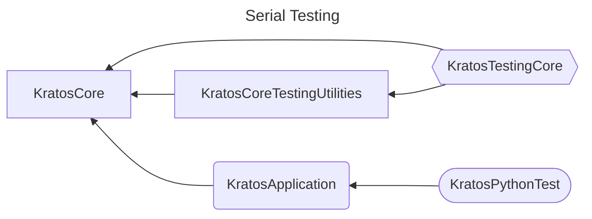
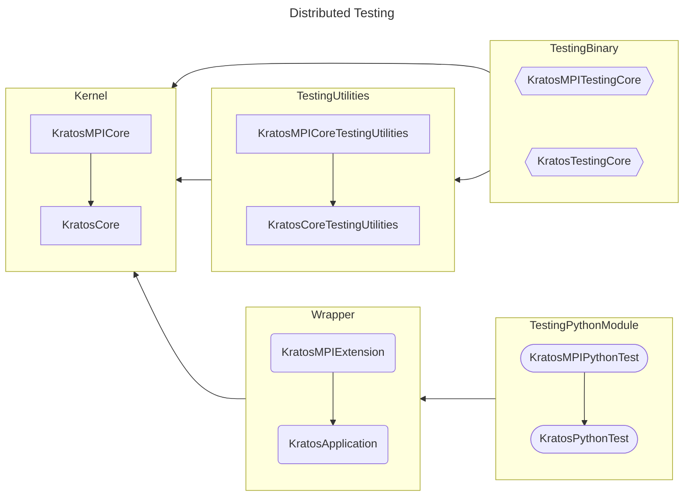

## Overview

This section will descrive the different layers of Kratos testing, and its characteristics.

- [Organization](#organization)
- [Cpp Tests](#cpp-tests)
- [MPI Cpp Tests](#mpi-cpp)

If you are interested in examples, how to run tests, and how are run in our CI, please refeer to:

- [Quick Start+](/docs/pages/Kratos/Testing/General/testing_quick_start.md)
- [Examples](/docs/pages/Kratos/Testing/General/testing_examples.md)
- [CI configuration](/docs/pages/Kratos/Testing/General/testing_ci.md)

### Organization

The tests in Kratos are organized as follows. In short the phylosohpy is that both cpp and python can make use of the core components but do not interact between them. For usability purposes, all distributed versions have access to its serial counterparts but not the other way around and respecting the cpp-python isolation. 

The following diagrams show the strcture for the Kernel but the same applies for the diffent applications.








### CPP Tests

Cpp tests refer to those that are interacting directly with the C++ layer of Kratos. This tests are intended as unitary tests and are build with the GTests library.

GTest consist on a `main` that will discover all testing suits compiled along it. Kratos uses its own `main` which is defined in `kratos/testing/testing.cpp` and initialized the environment and the event listener using the `InitializKernel` function.

#### Compilation

In order to compile your test you must use add these lines to your application cmakefile (please replace the `[NAME]` token with the name of your application`).

```CMake
## Application testing sources
if(${KRATOS_BUILD_TESTING} MATCHES ON)
    file(GLOB_RECURSE KRATOS_[NAME]_APPLICATION_TESTING_SOURCES ${CMAKE_CURRENT_SOURCE_DIR}/tests/*.cpp)
    kratos_add_gtests(TARGET Kratos[NAME]Core SOURCES "${KRATOS_[NAME]_APPLICATION_TESTING_SOURCES}")
endif(${KRATOS_BUILD_TESTING} MATCHES ON)
```

The `kratos_add_gtests` macro has several options that you can customize:

- **TARGET**: The name of the resulting binary object
- **SOURCES**: The list of the files containing the source code of your tests
- **USE_CUSTOM_MAIN**: If add a custom main must be present in your source and will be used to run them. Otherwise the common Kratos main will be used (default `false``)
- **USE_MPI**: If present, the tests will be compiled with MPI support (default `false`)
- **WORKING_DIRECTORY**: Indicates if a custom directoy must be used while executing the tests (for example you want to change the relative path from which the binary fetches the configuration files etc...)

By default, the target binary will have access to all the symbols `KratosCore` and `KratosCoreTestUtilities` but will not be able to access to symbols defined in `KratosCoreTests`.

#### Test structure

Cpp tests are organized in suites. From kratos you are provided with two basic suits: `KratosCoreFastSuite` and `KratosMPICoreFastSuite` which only initiailize the kernel and mpi attributes respecitvely. 

In order to create tests for you applications you will need to define a new clase derived from one of those and initialize it accordingly with the needs of your application.

It is advisable that you divide your tests into multiple suits if the tests have differnt requeirements or you want to run different subsets more conviniently. Dividing tests in different suits is also helpfull in order to keep them as minimal and restricted as possible. 

For example, we present the case of the `GeoMechanicsApplications` where two custom suits are defined to run tests that need:

##### Header
```c++
#pragma once

#include "geo_mechanics_application.h"
#include "linear_solvers_application.h"
#include "testing/testing.h"

namespace Kratos::Testing
{

 class KratosGeoMechanicsFastSuite : public KratosCoreFastSuite
 {
 public:
     KratosGeoMechanicsFastSuite();

 private:
     KratosGeoMechanicsApplication::Pointer mpGeoApp;
     KratosLinearSolversApplication::Pointer mpLinearSolversApp;
 };

 class KratosGeoMechanicsIntegrationSuite : public KratosCoreFastSuite
 {
 public:
     KratosGeoMechanicsIntegrationSuite();

 private:
     KratosGeoMechanicsApplication::Pointer mpGeoApp;
     KratosLinearSolversApplication::Pointer mpLinearSolversApp;
 };

} // namespace Kratos::Testing
```

##### Source
```c++
#include "geo_mechanics_fast_suite.h"

namespace Kratos::Testing
{

KratosGeoMechanicsFastSuite::KratosGeoMechanicsFastSuite() : KratosCoreFastSuite()
{
    mpGeoApp = std::make_shared<KratosGeoMechanicsApplication>();
    this->ImportApplicationIntoKernel(mpGeoApp);
    mpLinearSolversApp = std::make_shared<KratosLinearSolversApplication>();
    this->ImportApplicationIntoKernel(mpLinearSolversApp);
}

KratosGeoMechanicsIntegrationSuite::KratosGeoMechanicsIntegrationSuite() : KratosCoreFastSuite()
{
    mpGeoApp = std::make_shared<KratosGeoMechanicsApplication>();
    this->ImportApplicationIntoKernel(mpGeoApp);
    mpLinearSolversApp = std::make_shared<KratosLinearSolversApplication>();
    this->ImportApplicationIntoKernel(mpLinearSolversApp);
}

} // namespace Kratos::Testing

```

In this example each suit defines a set of required applications and imports them. While in this particular example both suites have the same requirements, this is not enforced and you can add or remove requirements as needed.

Once your suits are defined you can create your tests with the `KRATOS_TEST_CASE_IN_SUITE` macro where its first argument is the name of the tests, and the second the suit in which it will run.

```c++
KRATOS_TEST_CASE_IN_SUITE(NameOfTheTest, KratosGeoMechanicsFastSuite)
{
    KRATOS_EXPECT_TRUE(1 < 2)
}
```

The list of checks that can be performed is defined in `kratos/includes/expect.h` and is the following

- **KRATOS_FAIL()**: Automatically fails a tests
- **KRATOS_SUCCEED()**: Automatically pases a test
- **KRATOS_EXPECT_TRUE(a)**: Checks if `a` is evaluated to `True`
- **KRATOS_EXPECT_FALSE(a)**: Checks if `a` is evaluated to `False`
- **KRATOS_EXPECT_EQ(a,b)**: Checks if `a` is equal to `b` using the `==` operator.
- **KRATOS_EXPECT_NE(a,b)**: Checks if `a` is not equal to `b` using the `!=` operator.
- **KRATOS_EXPECT_STREQ(a,b)**: Checks if two strings are equal using string comparison. 
- **KRATOS_EXPECT_STRNE(a,b)**: Checks if two strings are not equal using string comparison.
- **KRATOS_EXPECT_LT(a,b)**: Checks if `a` is lesser than `b` using the `<` operator.
- **KRATOS_EXPECT_LE(a,b)**: Checks if `a` is lesser or equal than `b` using the `<=` operator.
- **KRATOS_EXPECT_GT(a,b)**: Checks if `a` is greater than `b` using the `>` operator.
- **KRATOS_EXPECT_GE(a,b)**: Checks if `a` is greater or equal than `b` using the `>=` operator.
- **KRATOS_EXPECT_HAS_SUBSTRING(TheString, SubString)**: Checks if `SubString` is a substring of `TheString`
- **KRATOS_EXPECT_NEAR(a,b,tolerance)**: Checks if `abs(a - b)` is less than a given `tolerance`
- **KRATOS_EXPECT_RELATIVE_NEAR(a, b, tolerance)**: Checks if `abs(((a) - (b))/(b))` is less than a given `tolerance`
- **KRATOS_EXPECT_DOUBLE_EQ(a,b)**: Checks if `a` is equal to `b` for `doubles`.
- **KRATOS_EXPECT_VECTOR_EQ(a, b)**: Checks if `a[i]` is equal to `b[i]` for every element `i` of vectors `a`, `b` using the `==` operator.
- **KRATOS_EXPECT_VECTOR_NEAR(a,b,tolerance)**: Checks if `abs(a[i] - b[i])` for every element `i` of vectors `a`, `b` is less than a given `tolerance`
- **KRATOS_EXPECT_VECTOR_RELATIVE_NEAR(a,b,tolerance)**: Checks if `abs(((a[i]) - (b[i]))/(b[i]))` for every element `i` of vectors `a`, `b` is less than a given `tolerance`
- **KRATOS_EXPECT_MATRIX_EQ(a, b)**: Checks if `a[i][j]` is equal to `b[i][j]` for every element `i,j` of matrices `a`, `b` using the `==` operator.
- **KRATOS_EXPECT_MATRIX_NEAR(a,b,tolerance)**: Checks if `abs(a[i][j] - b[i][j])` for every element `i,j` of matrices `a`, `b` is less than a given `tolerance`
- **KRATOS_EXPECT_MATRIX_RELATIVE_NEAR(a, b, tolerance)**: Checks if `abs(((a[i][j]) - (b[i][j]))/(b[i][j]))` for every element `i,j` of matrices `a`, `b` is less than a given `tolerance`
- **KRATOS_EXPECT_EXCEPTION_IS_THROWN(TheStatement, TheErrorMessage)**: Checks if `TheStatement` throws an exception and that `TheErrorMessage` is present in the thrown message
- **KRATOS_EXPECT_VARIABLE_IN_NODAL_DATA(TheVariable, TheNode)**: Checks if `TheVariable` is present in `TheNode` with the `SolutionStepsDataHas` operator.
- **KRATOS_EXPECT_DOF_IN_NODE(TheVariable, TheNode)**: Checks if `TheVariable` is present in `TheNode` with the `HasDofFor` operator.

#### Testing Environment

Every Test runs in an envorment which is defeined in `kratos/testing/testing.h`

While more info can be found in the official GTest documentation, for Kratos in particular `KratosTestEnv` controls what happens when a test suite is created (i.e. how it is configured, what is going to be printed, global initializations thall will affect al tests, etc.) and it is defined in `testing_environment.cpp`

For serial tests in the kernel, the only difference with a standard GTest environment is the useage of a custom `EventListetener` to allow the use to fine-tune what is printed during the testing.

#### Event Listener

An event lister allows you to intercept all the communications with the GTest library. You can hook custom events such as `OnTestProgramStart` or `OnTestCaseStart`.

For example in order to only show the tests result if they have failed or have succedded at the user choice, one could redefine `OnTestEnd` as:

```c++
virtual void OnTestEnd(const ::testing::TestInfo& test_info) override
{
    if((showInlineFailures && test_info.result()->Failed()) || (showSuccesses && !test_info.result()->Failed())) {
        eventListener->OnTestEnd(test_info);
    }
}
```

Currently the Kratos has a custom event listener which redefines the following hooks:

- OnTestProgramStart
- OnTestIterationStart
- OnEnvironmentsSetUpStart
- OnEnvironmentsSetUpEnd
- OnTestCaseStart
- OnTestStart
- OnTestPartResult
- OnTestEnd
- OnTestCaseEnd
- OnEnvironmentsTearDownStart
- OnEnvironmentsTearDownEnd
- OnTestIterationEnd
- OnTestProgramEnd

With the following options:

- showStart
- showIterations
- showTestCases
- showTestNames
- showSuccesses
- showInlineFailures
- showEnvironment
- showResult
- showEnd

### MPI Cpp

While overall the same rules and structure from `cpp-test` apply, for mpi there are important changes that must be taken into account while developing distributed tests.

Please note that most importantly there are two changes happening under the hood:

1) The `mKernel` is initialized with the distributed flag set to `true`.
2) The `main` file is using a different initialization code `InitializeMPITesting` and it is changing some events and the execution environment. 

In particular, in the `InitializeMPITesting` function, the most relevant changes are:

- The initialization process of MPI:

```C++
class MPIGTestMain {
    public:

    static int InitializeMPITesting(int argc, char* argv[]) {
        // Initialize MPI
        MPI_Init(&argc, &argv);

        // Initialize the tests
        ::testing::InitGoogleTest(&argc, argv);

        // Get the size and rank 
        int rank = 0;
        int size = 0;

        MPI_Comm_rank(MPI_COMM_WORLD, &rank);
        MPI_Comm_size(MPI_COMM_WORLD, &size);

        // Execute the rest of the intialization process
        ...

        // Call the tests
        auto testing_resut = RUN_ALL_TESTS();

        // Finalize MPI
        MPI_Finalize();

        // Run the tests
        return testing_resut;
        }
}   
```

- Replacing the default testing environment:

```C++
// Add the MPI environment to the test 
::testing::AddGlobalTestEnvironment(new Kratos::Testing::KratosMpiTestEnv);
```

#### Compilation

Compilation of mpi distributed tests its recomended in a separate binary. In order to link with the correct libraries, the `USE_MPI` must be activated in the macro defining the target.

```CMake
## Application distributed testing sources
if(${KRATOS_BUILD_TESTING} MATCHES ON)
    file(GLOB_RECURSE KRATOS_[NAME]_APPLICATION_TESTING_SOURCES ${CMAKE_CURRENT_SOURCE_DIR}/mpi_tests/*.cpp)
    kratos_add_gtests(TARGET Kratos[NAME]Core SOURCES "${KRATOS_[NAME]_APPLICATION_TESTING_SOURCES}" USE_MPI)
endif(${KRATOS_BUILD_TESTING} MATCHES ON)
```

We encourage that for codes using mpi specific distributed memory extensions are made, but it is possible to have multiple testing binaries targeting distributed and non-distributed tests together (For example see CoSimulationApplication)

BAs with the serial version, the target binary will have access to all the symbols `KratosCore`, `KratosMPICore`, `KratosCoreTestUtilities` and `KratosMPICoreTestUtilities` and all the MPI libraries from your selected vendor but will not be able to access to symbols defined in `KratosCoreTests`.

#### Testing Structure

MPI Cpp tests are organized as regular cpp tests but the base suite needs to change to `KratosMPICoreFastSuite` like so:

```C++
// External includes
#include <gmock/gmock.h>
#include <gtest/gtest.h>

// Project includes
#include "mapping_distributed_suite.h"

namespace Kratos::Testing {

KratosMappingMPIFastSuite::KratosMappingMPIFastSuite()
    : KratosMPICoreFastSuite() {
  mpMappingApp = std::make_shared<KratosMappingApplication>();
  this->ImportApplicationIntoKernel(mpMappingApp);
}

} // namespace Kratos::Testing
```

Please note that `KratosMPICoreFastSuite` defines a custom `TearDown` function to collect the global status of the tests from the different processes spawned that should be respected if derived.

```C++
void KratosMPICoreFastSuite::TearDown() {
    int has_failure = ::testing::Test::HasFailure();

    // Synchronize the failre status
    MPI_Allreduce(MPI_IN_PLACE, &has_failure, 1, MPI_INT, MPI_SUM, MPI_COMM_WORLD);

    // If any of the processes has issued a failure, fail the whole tests
    if (has_failure) {
        KRATOS_FAIL();
    }
}
```

#### Testing Environment

As stated before, the testing environment (found in `kratos/mpi/tests/test_utilities/mpi_testing_environment.cpp`) has some important changes respect to the non-distributed version as descrived below.

1) Defining a default `DataCommunicator` using the `MPI_COMM_WORLD` and setting is as the default `DataCommunicator` in Kratos:

```C++
// Define the World DataCommunicator as a wrapper for MPI_COMM_WORLD and make it the default.
ParallelEnvironment::RegisterDataCommunicator("World", MPIDataCommunicator::Create(MPI_COMM_WORLD), ParallelEnvironment::MakeDefault);
```

2) Registering factories for the different MPI based communicators to be used by the different modelParts in the tests. For instance (But more may apply):

```C++
// Register the MPICommunicator to be used as factory for the communicator.
ParallelEnvironment::RegisterCommunicatorFactory<const std::string>([](ModelPart& rModelPart, const std::string& rDataCommunicatorName) -> Communicator::UniquePointer {
    const auto& r_data_communicator = ParallelEnvironment::GetDataCommunicator(rDataCommunicatorName);
    return Kratos::make_unique<MPICommunicator>(&(rModelPart.GetNodalSolutionStepVariablesList()), r_data_communicator);
});
```

Please be aware that, as we chose to use `MPI_COMM_WORLD` as our default `MPI_COMM`, advanced distributed tests may need to define custom different enviroments / main functions using the `USE_CUSTOM_MAIN` flag in order to run correctly.

Please also notice that since the Environment is deallocated before the destruction of the kernel, the `TearDown` function of the `KratosMpiTestEnv` creates a temporal comunnicator that will be then dealocated during the deallocation of the Kratos kernel.

#### Event Listener

In the distributed enviroment, all messages from the GTest library except from the test output are filtered for all processes except the process with `rank==0`

In particular:

```C++
// Set the listener configuration (by default false to all if rank != 0)
if (rank != 0) {
    listener->showStart = false;
    listener->showIterations = false;
    listener->showEnvironment = false;
    listener->showTestCases = false;
    listener->showTestNames = false;
    listener->showSuccesses = false;
    listener->showInlineFailures = false;
    listener->showResult = false;
    listener->showEnd = false;
}
```

Which can be tweaked according to different needs.
