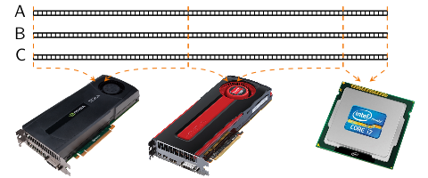

Managing memory
===============

Allocating
----------

The :cpp:class:`vex::vector\<T>` class constructor accepts a const reference to
``std::vector<vex::backend::command_queue>``. A :cpp:class:`vex::Context`
instance may be conveniently converted to this type, but it is also possible to
initialize the command queues elsewhere (e.g. with the OpenCL backend
``vex::backend::command_queue`` is typedefed to ``cl::CommandQueue``), thus
completely eliminating the need to create a :cpp:class:`vex::Context`.  Each
command queue in the list should uniquely identify a single compute device.

The contents of the created vector will be partitioned across all devices that
were present in the queue list.  The size of each partition will be
proportional to the device bandwidth, which is measured the first time the
device is used. All vectors of the same size are guaranteed to be partitioned
consistently, which minimizes inter-device communication.

In the example below, three device vectors of the same size are allocated.
Vector ``A`` is copied from the host vector ``a``, and the other vectors are
created uninitialized:

.. code-block:: cpp

    const size_t n = 1024 * 1024;
    vex::Context ctx( vex::Filter::Any );

    std::vector<double> a(n, 1.0);

    vex::vector<double> A(ctx, a);
    vex::vector<double> B(ctx, n);
    vex::vector<double> C(ctx, n);

Assuming that the current system has an NVIDIA GPU, an AMD GPU, and an Intel
CPU installed, possible partitioning may look like this:

.. doxygenclass:: vex::vector
    :members:

Copying
-------

The :cpp:func:`vex::copy()` function allows to copy data between host and
compute device memory spaces.  There are two forms of the function -- a simple
one which accepts whole vectors, and an STL-like one, which accepts pairs of
iterators:

.. code-block:: cpp

    std::vector<double> h(n);       // Host vector.
    vex::vector<double> d(ctx, n);  // Device vector.

    // Simple form:
    vex::copy(h, d);    // Copy data from host to device.
    vex::copy(d, h);    // Copy data from device to host.

    // STL-like form:
    vex::copy(h.begin(), h.end(), d.begin()); // Copy data from host to device.
    vex::copy(d.begin(), d.end(), h.begin()); // Copy data from device to host.

The STL-like variant can copy sub-ranges of the vectors, or copy data from/to
raw host pointers.

Vectors also overload the array subscript operator,
:cpp:func:`vex::vector::operator[]`, so that users may directly read or
write individual vector elements. This operation is highly ineffective and
should be used with caution. Iterators allow for element access as well, so
that STL algorithms may in principle be used with device vectors. This would be
very slow but may be used as a temporary building block.

Another option for host-device data transfer is mapping device memory buffer to
a host array. The mapped array then may be transparently read or written.  The
method :cpp:func:`vex::vector::map` maps the d-th partition of
the vector and returns the mapped array:

.. code-block:: cpp

    vex::vector<double> X(ctx, N);
    {
        auto mapped_ptr = X.map(0); // Unmapped automatically when goes out of scope
        for(size_t i = 0; i < X.part_size(0); ++i)
            mapped_ptr[i] = host_function(i);
    }

Shared virtual memory
---------------------

Both OpenCL 2.0 and CUDA 6.0 allow to share the same virtual address range
between the host and the compute devices, so that there is no longer need to
copy buffers between devices. In other words, no keeping track of buffers and
explicitly copying them across devices! Just use shared pointers. OpenCL 2.0
calls this concept `Shared Virtual Memory`_ (SVM), and CUDA 6.0 talks about
`Unified Memory`_. In VexCL, both of these are abstracted into
:cpp:class:`vex::svm_vector\<T>` class.

The :cpp:class:`vex::svm_vector\<T>` constructor, as opposed to
:cpp:class:`vex::vector\<T>`, takes single instance of
``vex::backend::command_queue``. This is because the SVM vector has to be
associated with a single device context. The SVM vectors in VexCL may be used
in the same way normal vectors are used.

Example:

.. code-block:: cpp

    // Allocate SVM vector for the first device in context:
    vex::svm_vector<int> x(ctx.queue(0), n);

    // Fill the vector on the host.
    {
        auto p = x.map(vex::backend::MAP_WRITE);
        for(int i = 0; i < n; ++i)
            p[i] = i * 2;
    }

.. _`Shared Virtual Memory`: http://developer.amd.com/community/blog/2014/10/24/opencl-2-shared-virtual-memory/
.. _`Unified Memory`: https://devblogs.nvidia.com/parallelforall/unified-memory-in-cuda-6/

.. doxygenclass:: vex::svm_vector
    :members:
